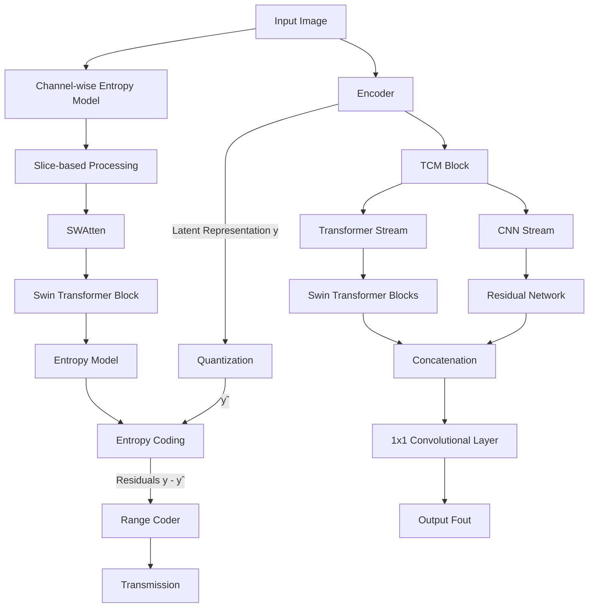


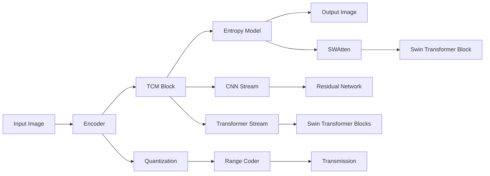


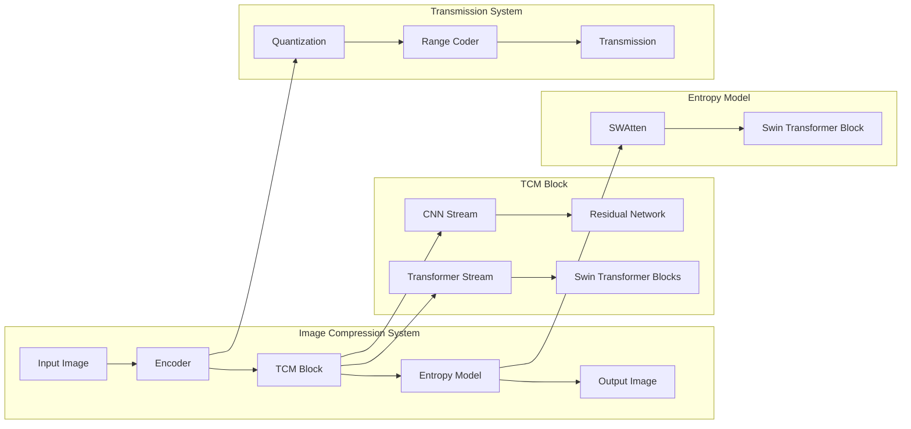

```mermaid
graph LR
    subgraph "Image Compression System"
        style "Image Compression System" fill:#f2eeee,stroke:#333
        A[Input Image] --> B[Encoder]
        B --> C[TCM Block]
        C --> D[Entropy Model]
        D --> E[Output Image]
    end
    subgraph "TCM Block"
        style "TCM Block" fill:#f2eeee,stroke:#333
        C --> I[CNN Stream]
        C --> J[Transformer Stream]
        I --> K[Residual Network]
        J --> L[Swin Transformer Blocks]
    end
    subgraph "Entropy Model"
        style "Entropy Model" fill:#f2eeee,stroke:#333
        D --> M[SWAtten]
        M --> N[Swin Transformer Block]
    end
    subgraph "Transmission System"
        style "Transmission System" fill:#f2eeee,stroke:#333
        B --> F[Quantization]
        F --> G[Range Coder]
        G --> H[Transmission]
    end

```

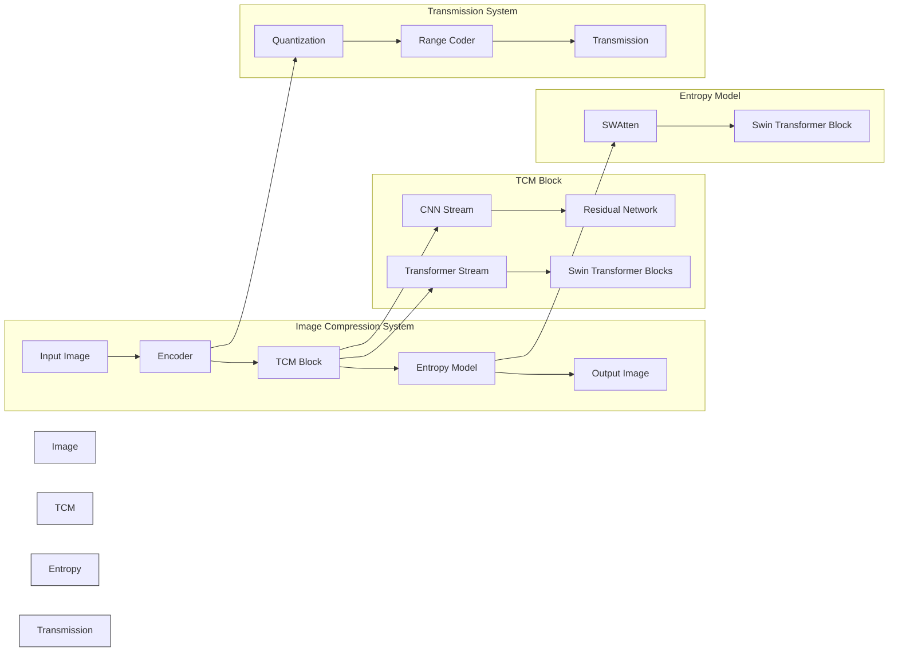

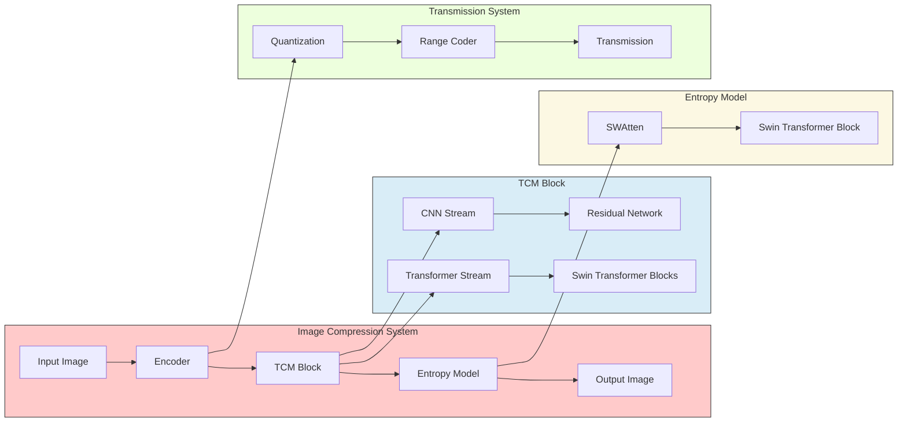

# NEW

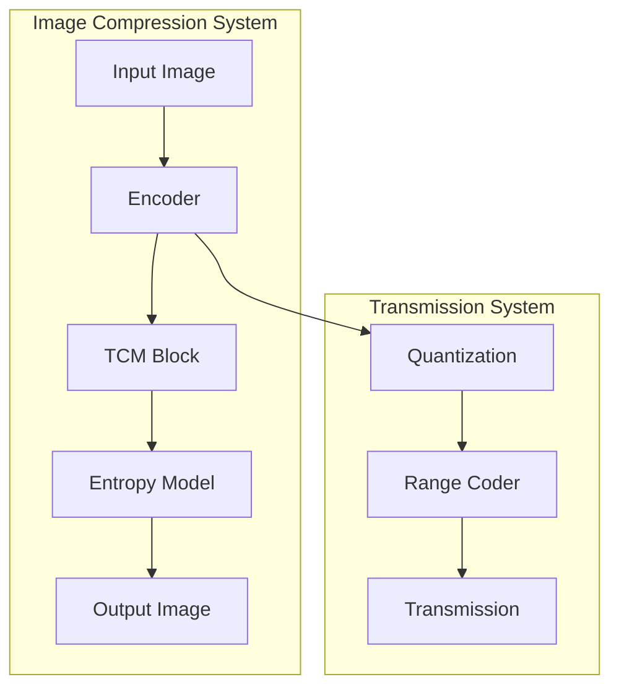
```mermaid
%% Use Case Diagram
usecaseDiagram
    participant User
    participant System
    User --> (Compress Image)
    User --> (Decompress Image)
    System --> (Compress Image)
    System --> (Decompress Image)
```

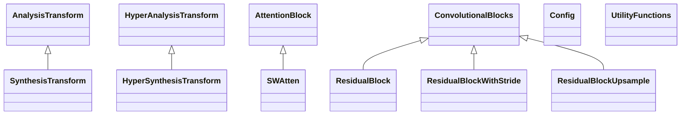

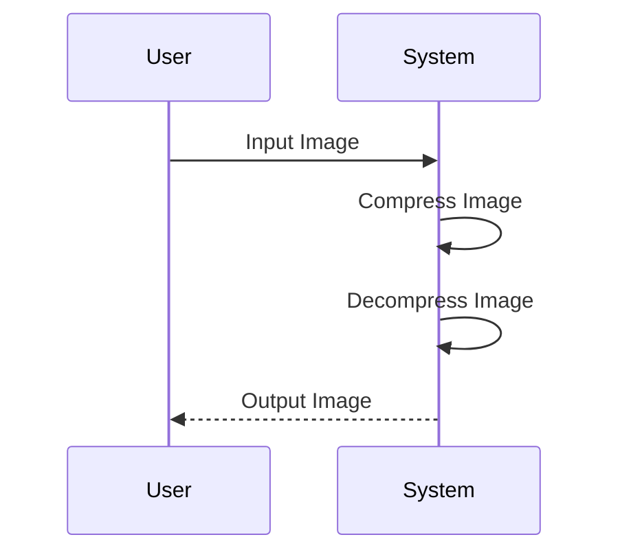


# Copilot Answer

### Data Flow Diagram
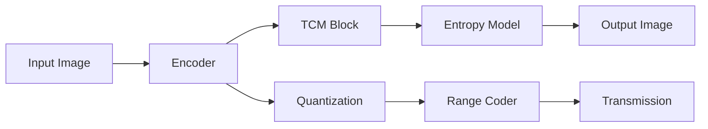

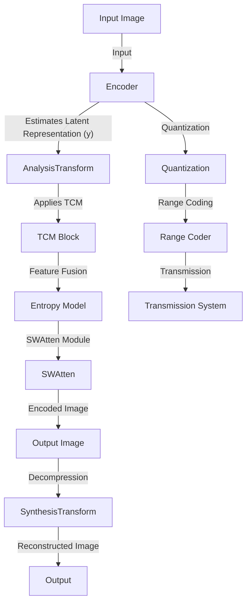

```
    style A fill:#f9f,stroke:#333
    style B fill:#fcf,stroke:#333
    style C fill:#cff,stroke:#333
    style D fill:#cfc,stroke:#333
    style E fill:#ff9,stroke:#333
    style F fill:#9ff,stroke:#333
    style G fill:#f9f,stroke:#333
    style H fill:#f9f,stroke:#333
    style I fill:#f9f,stroke:#333
    style J fill:#fcf,stroke:#333
    style K fill:#cff,stroke:#333
    style L fill:#cfc,stroke:#333

```
### Use Case Diagram
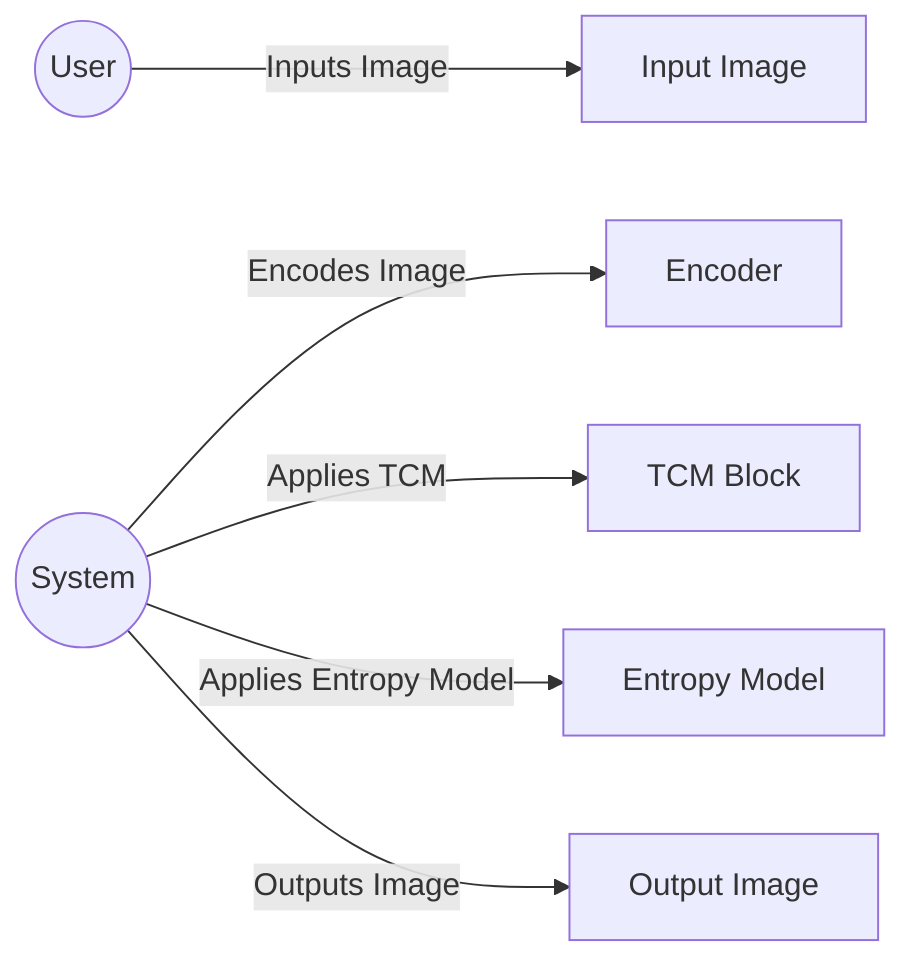

#### 2
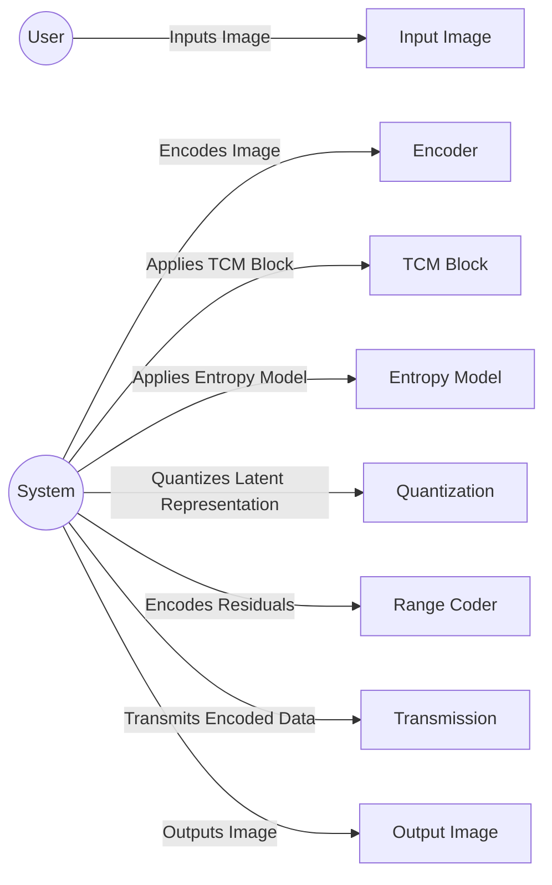

![[Pasted image 20240409132922.png]]

### Class Diagram

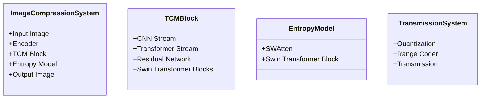

#### 2

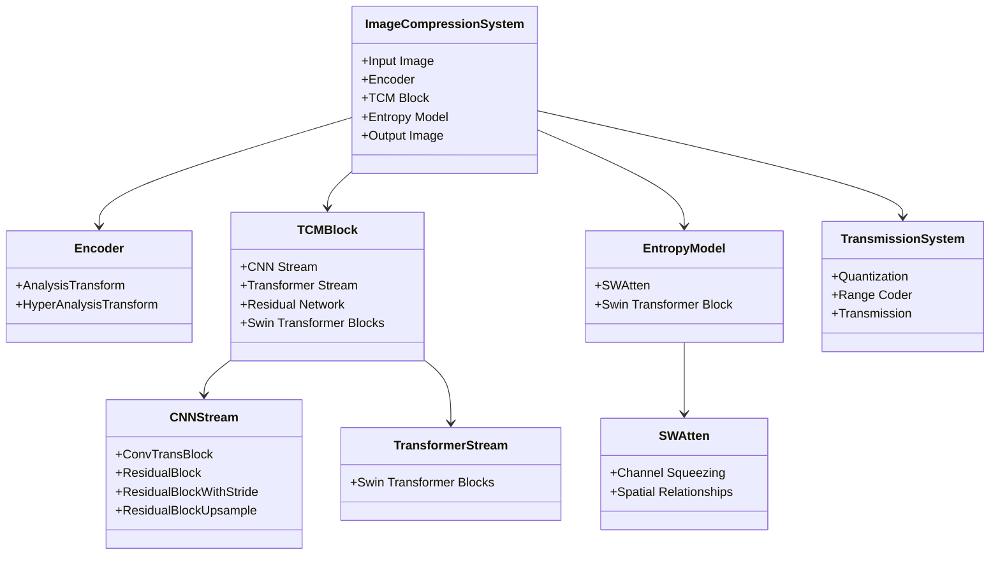

### Sequence Diagram
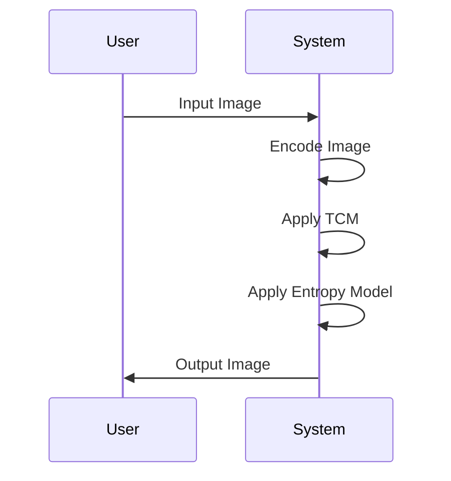


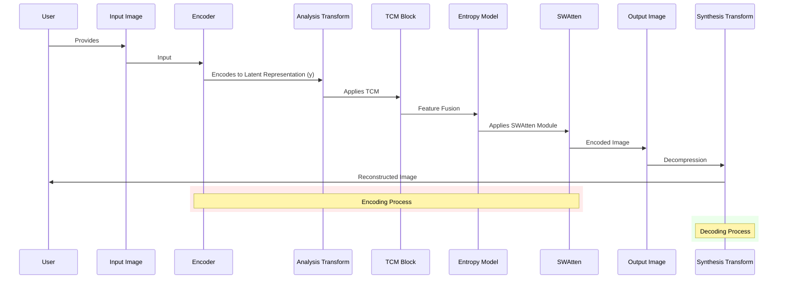
