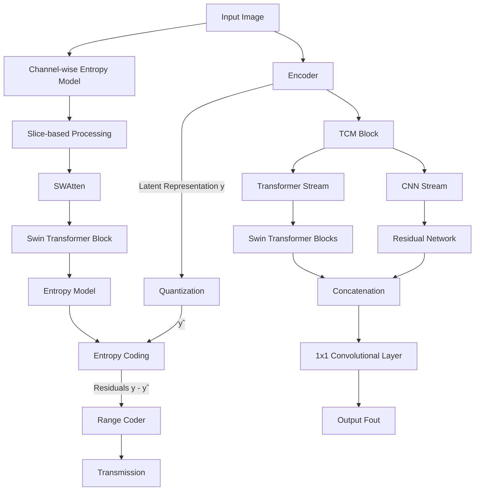
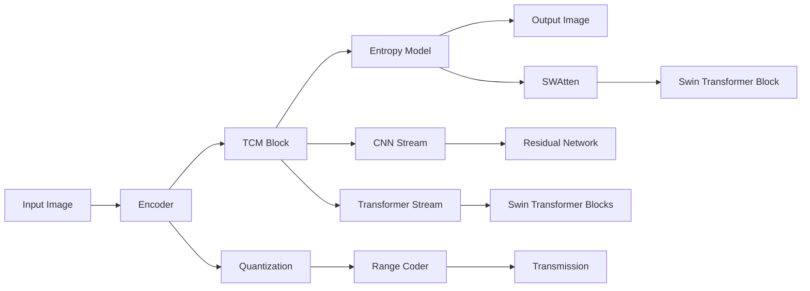
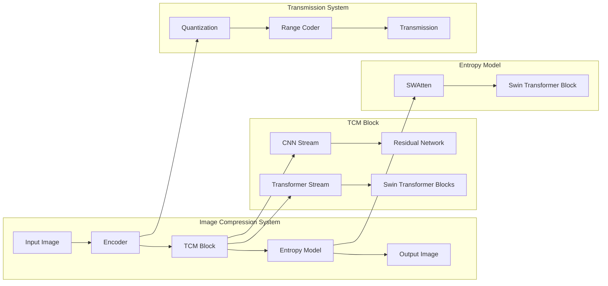
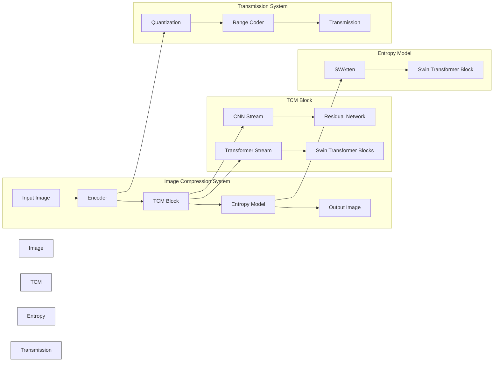
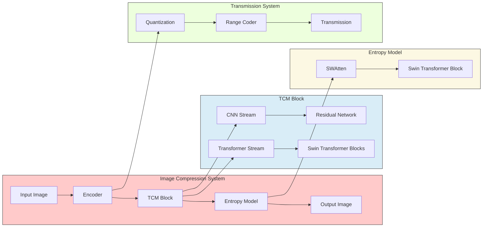

```mermaid
graph LR
    subgraph "Image Compression System"
        style "Image Compression System" fill:#f2eeee,stroke:#333
        A[Input Image] --> B[Encoder]
        B --> C[TCM Block]
        C --> D[Entropy Model]
        D --> E[Output Image]
    end
    subgraph "TCM Block"
        style "TCM Block" fill:#f2eeee,stroke:#333
        C --> I[CNN Stream]
        C --> J[Transformer Stream]
        I --> K[Residual Network]
        J --> L[Swin Transformer Blocks]
    end
    subgraph "Entropy Model"
        style "Entropy Model" fill:#f2eeee,stroke:#333
        D --> M[SWAtten]
        M --> N[Swin Transformer Block]
    end
    subgraph "Transmission System"
        style "Transmission System" fill:#f2eeee,stroke:#333
        B --> F[Quantization]
        F --> G[Range Coder]
        G --> H[Transmission]
    end

```





