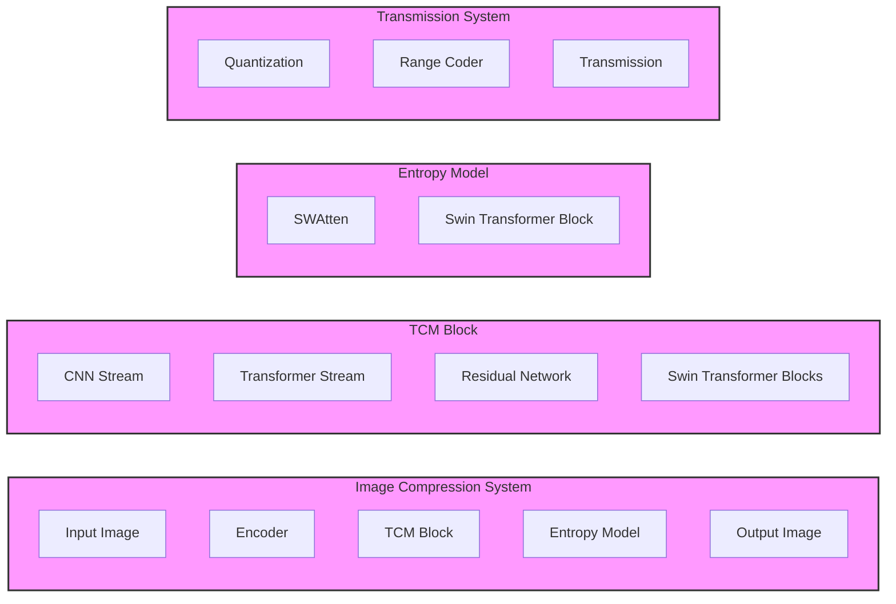

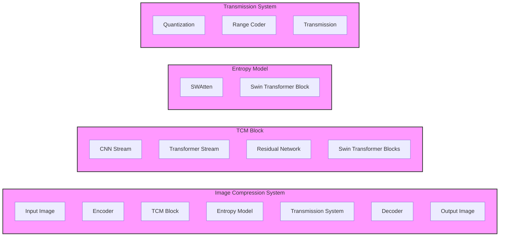


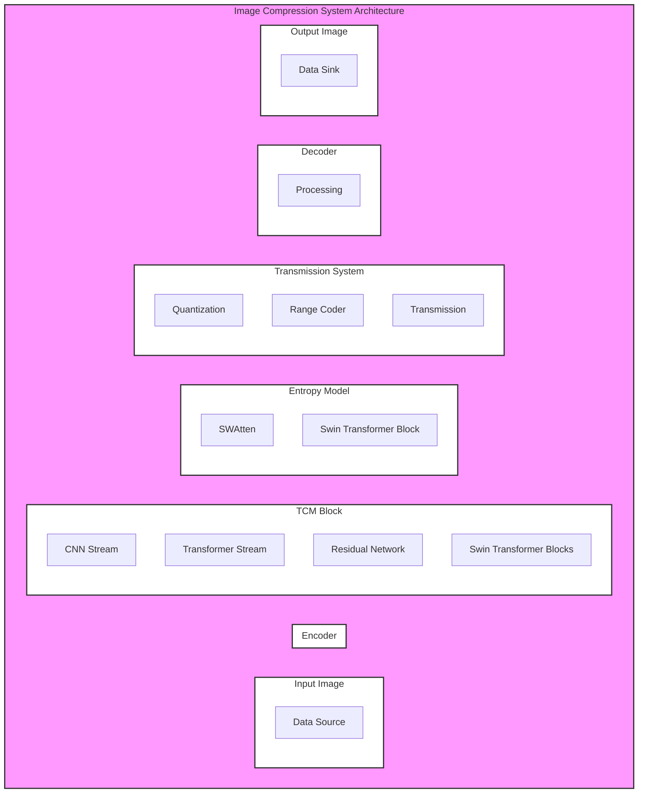

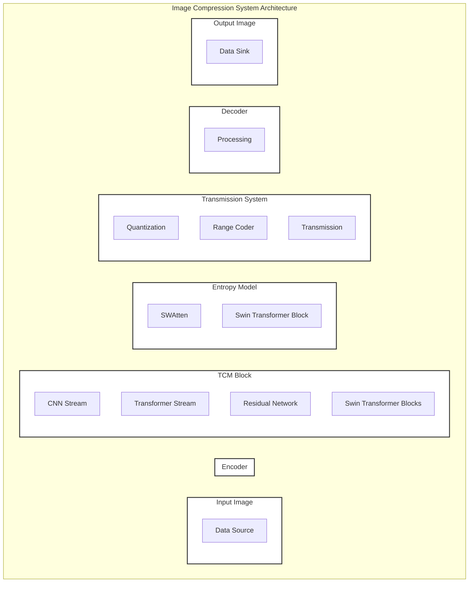

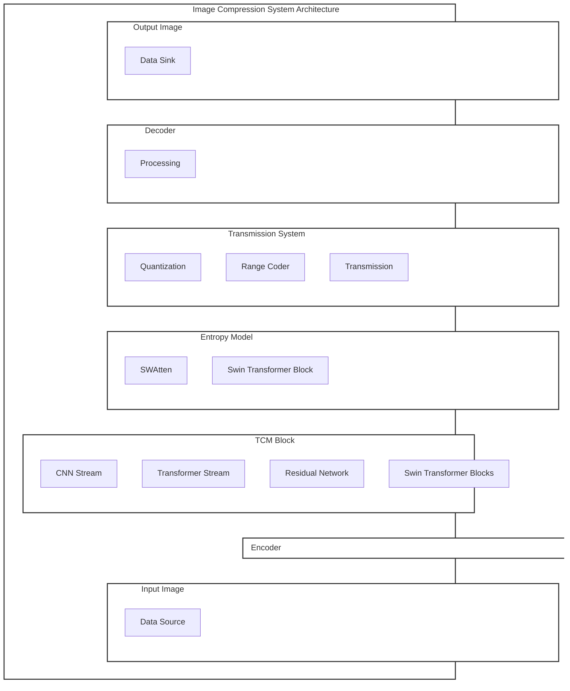

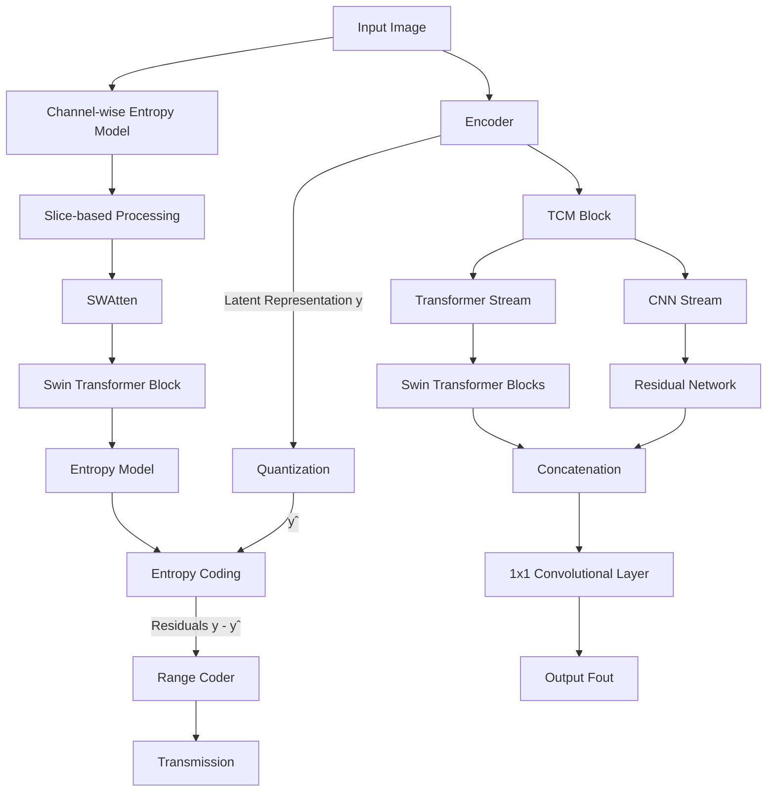


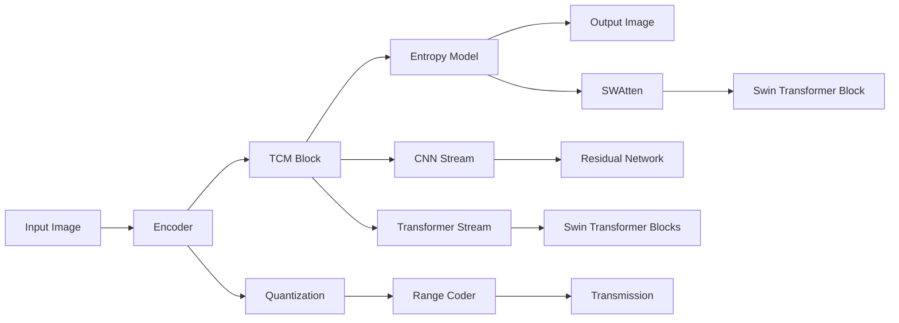


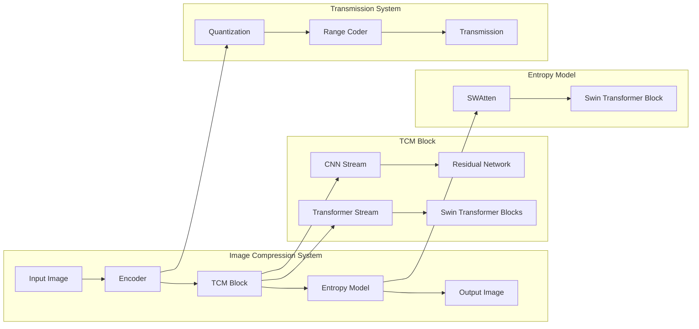

```mermaid
graph LR
    subgraph "Image Compression System"
        style "Image Compression System" fill:#f2eeee,stroke:#333
        A[Input Image] --> B[Encoder]
        B --> C[TCM Block]
        C --> D[Entropy Model]
        D --> E[Output Image]
    end
    subgraph "TCM Block"
        style "TCM Block" fill:#f2eeee,stroke:#333
        C --> I[CNN Stream]
        C --> J[Transformer Stream]
        I --> K[Residual Network]
        J --> L[Swin Transformer Blocks]
    end
    subgraph "Entropy Model"
        style "Entropy Model" fill:#f2eeee,stroke:#333
        D --> M[SWAtten]
        M --> N[Swin Transformer Block]
    end
    subgraph "Transmission System"
        style "Transmission System" fill:#f2eeee,stroke:#333
        B --> F[Quantization]
        F --> G[Range Coder]
        G --> H[Transmission]
    end

```

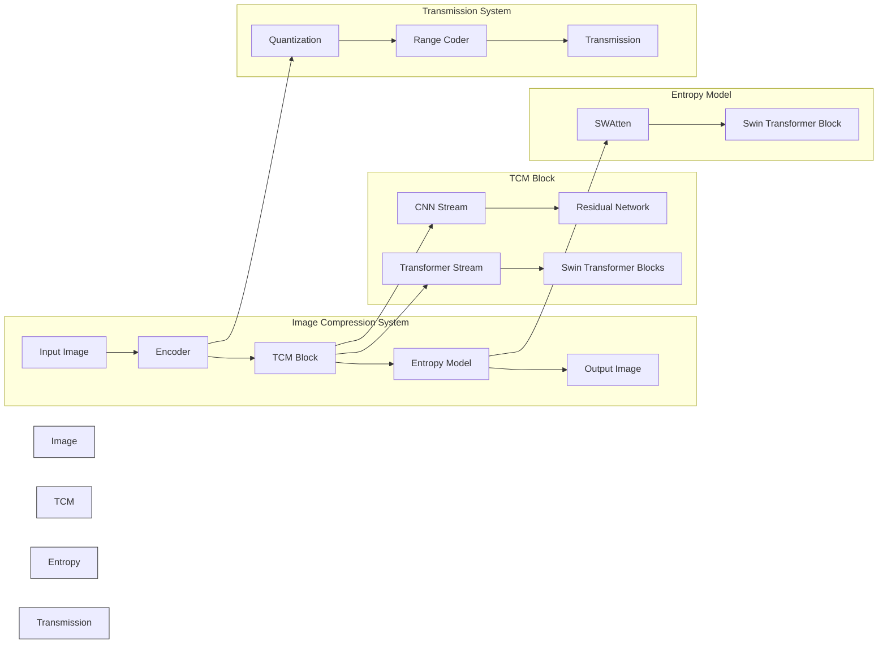

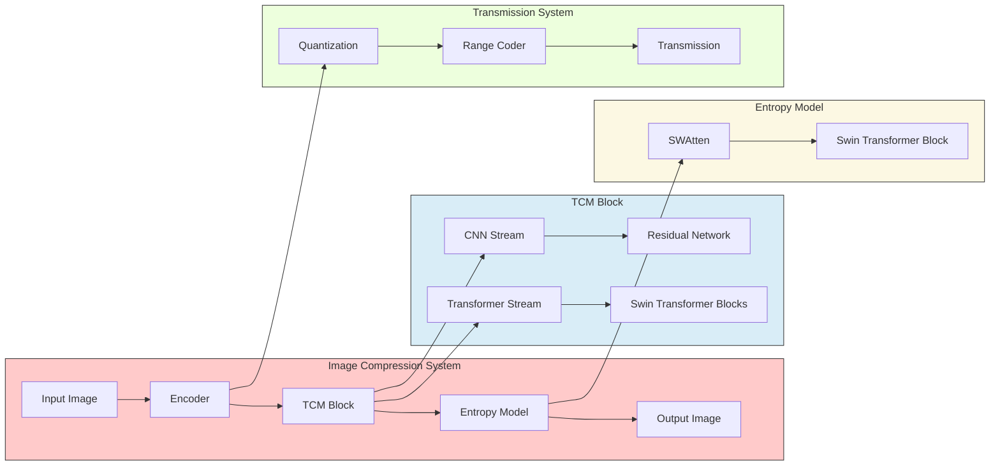

# NEW

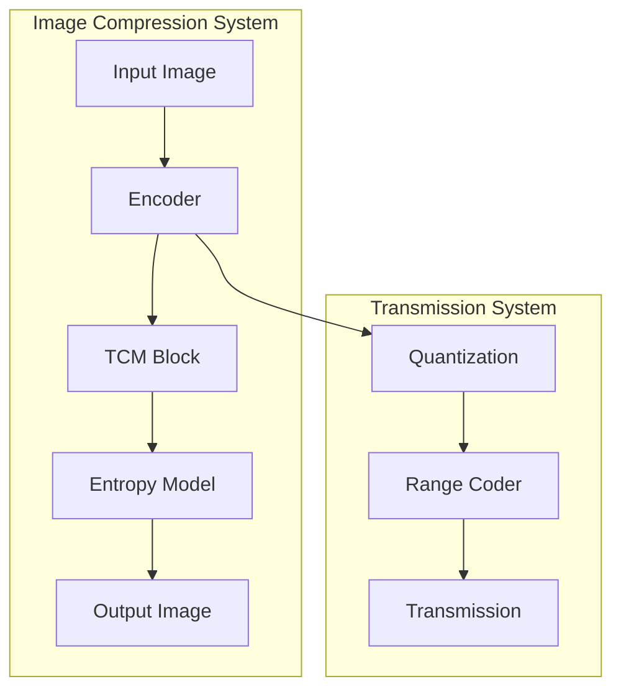
```mermaid
%% Use Case Diagram
usecaseDiagram
    participant User
    participant System
    User --> (Compress Image)
    User --> (Decompress Image)
    System --> (Compress Image)
    System --> (Decompress Image)
```

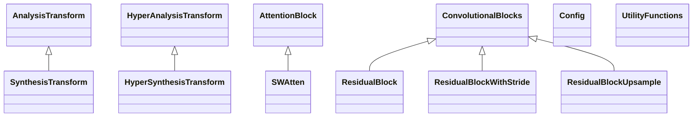

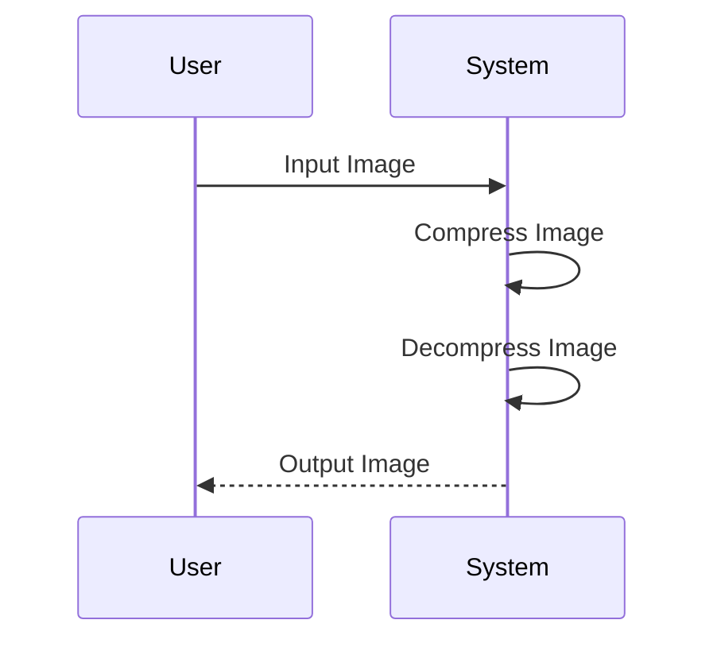


# Copilot Answer

### Data Flow Diagram
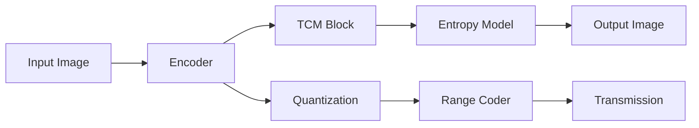

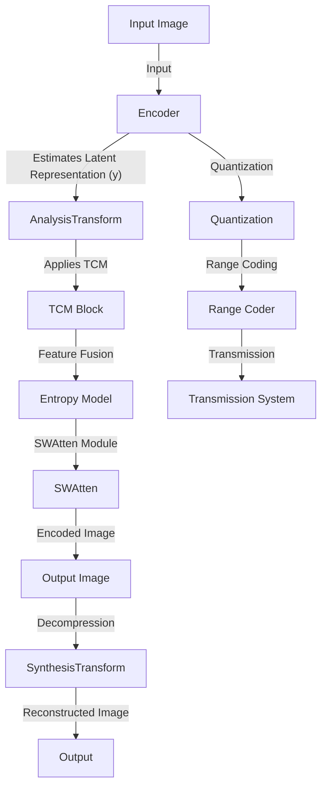

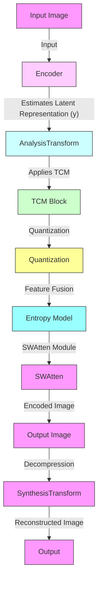


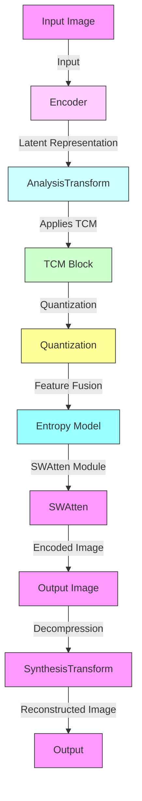

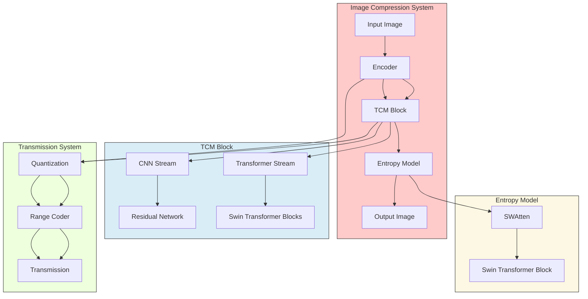


```mermaid
%% Data Flow Diagram
graph TD
    subgraph ImageCompressionSystem[Image Compression System]
        A[Input Image] --> B[Encoder]
        B --> C[TCM Block]
        C --> D[Entropy Model]
        D --> E[Output Image]
        style ImageCompressionSystem fill:#ffcaca,stroke:#333
    end
    subgraph TCMBlock[TCM Block]
        C --> I[CNN Stream]
        C --> J[Transformer Stream]
        I --> K[Residual Network]
        J --> L[Swin Transformer Blocks]
        style TCMBlock fill:#d9edf7,stroke:#333
    end
    subgraph EntropyModel[Entropy Model]
        D --> M[SWAtten]
        M --> N[Swin Transformer Block]
        style EntropyModel fill:#fcf8e3,stroke:#333
    end
    subgraph TransmissionSystem[Transmission System]
        B --> F[Quantization]
        F --> G[Range Coder]
        G --> H[Transmission]
        style TransmissionSystem fill:#edffdd,stroke:#333
    end

    B-->C
    C-->F
    F-->G
    G-->H

```


```mermaid
%% Data Flow Diagram
graph TD
    subgraph ImageCompressionSystem[Image Compression System]
        A[Input Image] --> B[Encoder]
        B --> C[TCM Block]
        C --> D[Entropy Model]
        D --> P[Decoder]
        P --> E[Output Image]
        style ImageCompressionSystem fill:#ffcaca,stroke:#333
    end
    subgraph TCMBlock[TCM Block]
        C --> I[CNN Stream]
        C --> J[Transformer Stream]
        I --> K[Residual Network]
        J --> L[Swin Transformer Blocks]
        style TCMBlock fill:#d9edf7,stroke:#333
    end
    subgraph EntropyModel[Entropy Model]
        D --> M[SWAtten]
        M --> N[Swin Transformer Block]
        style EntropyModel fill:#fcf8e3,stroke:#333
    end
    subgraph TransmissionSystem[Transmission System]
        C --> F[Quantization]
        F --> G[Range Coder]
        G --> H[Transmission]
        style TransmissionSystem fill:#edffdd,stroke:#333
    end


```


```mermaid
%% Data Flow Diagram
graph TD
    subgraph ImageCompressionSystem[Image Compression System]
        A[Input Image] --> B[Encoder]
        B --> C[TCM Block]
        C --> D[Entropy Model]
        D --> E[Output Image]
        style ImageCompressionSystem fill:#ffcaca,stroke:#333
    end
    subgraph TCMBlock[TCM Block]
        C --> I[CNN Stream]
        C --> J[Transformer Stream]
        I --> K[Residual Network]
        J --> L[Swin Transformer Blocks]
    
        style TCMBlock fill:#d9edf7,stroke:#333
    end
    subgraph EntropyModel[Entropy Model]
        D --> M[SWAtten]
        M --> N[Swin Transformer Block]
        style EntropyModel fill:#fcf8e3,stroke:#333
    end
    subgraph TransmissionSystem[Transmission System]
        C --> F[Quantization]
        F --> |Encoded Data| G[Range Coder]
        G --> |Compressed Data| H[Transmission]
        style TransmissionSystem fill:#edffdd,stroke:#333
    end

```


```mermaid
graph TD
    subgraph ImageCompressionSystem[Image Compression System]
        A[Input Image] -->|Input| B[Encoder]
        B -->|Estimates Latent Representation| C[TCM Block]
        C -->|Applies TCM| D[Entropy Model]
        D -->|Feature Fusion| E[Decoder]
        E -->|Decompressed Image| F[Output Image]
        style ImageCompressionSystem fill:#ffcaca,stroke:#333
    end
    subgraph TCMBlock[TCM Block]
        C -->|CNN Stream| I[Residual Network]
        C -->|Transformer Stream| J[Swin Transformer Blocks]
        style TCMBlock fill:#d9edf7,stroke:#333
    end
    subgraph EntropyModel[Entropy Model]
        D -->|SWAtten Module| M[Swin Transformer Block]
        style EntropyModel fill:#fcf8e3,stroke:#333
    end
    subgraph TransmissionSystem[Transmission System]
        C -->|Quantization| F[Range Coder]
        F -->|Encoded Data| G[Transmission]
        style TransmissionSystem fill:#edffdd,stroke:#333
    end

```


```mermaid
%% Data Flow Diagram
graph TD
    subgraph ImageCompressionSystem[Image Compression System]
        A[Input Image] --> B[Encoder]
        B --> C[TCM Block]
        C --> D[Entropy Model]
        D --> E[Decoder]
        E --> F[Output Image]
        style ImageCompressionSystem fill:#ffcaca,stroke:#333
    end
    subgraph TCMBlock[TCM Block]
        C --> I[CNN Stream]
        C --> J[Transformer Stream]
        I --> K[Residual Network]
        J --> L[Swin Transformer Blocks]
        style TCMBlock fill:#d9edf7,stroke:#333
    end
    subgraph EntropyModel[Entropy Model]
        D --> M[SWAtten]
        M --> N[Swin Transformer Block]
        style EntropyModel fill:#fcf8e3,stroke:#333
    end
    subgraph TransmissionSystem[Transmission System]
        C --> O[Quantization]
        O --> P[Range Coder]
        P --> Q[Transmission]
        style TransmissionSystem fill:#edffdd,stroke:#333
    end

    B-->C
    D-->E
    O-->|Encoded Data| P[Range Coder]
    P-->|Compressed Data| Q[Transmission]

```


```mermaid
%% Data Flow Diagram
graph TD
    subgraph ImageCompressionSystem[Image Compression System]
        A[Input Image] --> B((Encoder))
        D[Output Image] --> P((Decoder))
        style ImageCompressionSystem fill:#ffcaca,stroke:#333
    end
    subgraph TCMBlock[TCM Block]
        B --> C{Split F}
        C --> I[CNN Stream]
        C --> J[Transformer Stream]
        I --> K[Residual Network]
        J --> L[Swin Transformer Blocks]
        C --> F[Quantization]
        style TCMBlock fill:#d9edf7,stroke:#333
    end
    subgraph EntropyModel[Entropy Model]
        C --> D[Entropy Model]
        D --> M[SWAtten]
        M --> N[Swin Transformer Block]
        style EntropyModel fill:#fcf8e3,stroke:#333
    end
    subgraph TransmissionSystem[Transmission System]
        F --> G[Range Coder]
        G --> H[Transmission]
        style TransmissionSystem fill:#edffdd,stroke:#333
    end

    %% External Entities
    InputImage((Input Image))
    OutputImage((Output Image))

    %% Processes
    Encoder((Encoder))
    Decoder((Decoder))
    Quantization((Quantization))
    RangeCoder((Range Coder))
    Transmission((Transmission))

    %% Data Stores
    SWAtten((SWAtten))
    ResidualNetwork((Residual Network))
    SwinTransformer((Swin Transformer Blocks))

    %% Data Flows
    InputImage --> Encoder
    Encoder --> TCMBlock
    TCMBlock --> Quantization
    Quantization --> RangeCoder
    RangeCoder --> Transmission
    Transmission --> OutputImage
    SWAtten --> EntropyModel
    ResidualNetwork --> TCMBlock
    SwinTransformer --> TCMBlock

```


```mermaid
%% Data Flow Diagram
graph TD
    subgraph ExternalEntities
        InputImage((Input Image))
        OutputImage((Output Image))
    end

    subgraph Processes
        Encoder((Encoder))
        Decoder((Decoder))
        Quantization((Quantization))
        RangeCoder((Range Coder))
        Transmission((Transmission))
    end

    subgraph DataStores
        SWAtten((SWAtten))
        ResidualNetwork((Residual Network))
        SwinTransformer((Swin Transformer Blocks))
    end

    InputImage --> Encoder
    Encoder --> Quantization
    Quantization --> RangeCoder
    RangeCoder --> Transmission
    Transmission --> OutputImage

    Encoder --> TCMBlock
    TCMBlock --> Decoder
    TCMBlock --> SWAtten
    SWAtten --> EntropyModel
    TCMBlock --> ResidualNetwork
    TCMBlock --> SwinTransformer

```


```mermaid
graph LR
  subgraph Input[Input]
    A[Image] --> B(Encode)
  end

  subgraph TCM[TCM Block]
    B --> C(Extract Features)
    C --> D(Split Stream)
    D --> E(CNN Stream)
    D --> F(Transformer Stream)
    E --> G(Residual Network)
    F --> H(Swin Transformer)
    G --> I{Local Features}
	H --> I{Non-Local Features}

    I --> J(Concatenate)
  end

  subgraph Entropy[Entropy Model]
    C --> K(Channel-wise Entropy)
    K --> L(SWAtten)
    L --> M(Swin Transformer)
    M --> N(Residuals)
  end

  subgraph Transmission[Transmission Channel]
    C --> O(Quantization)
    O --> P(Range Coding)
    P --> Q(Transmission)
  end

  subgraph Output[Output]
    N --> R(Decode)
    R --> S(Image)
  end
```


```mermaid
graph LR
  subgraph Input[Input]
    A[Image] --> B(Encode)
  end

  subgraph TCM[TCM Block]
    B --> C(Extract Features)
    C --> D(Split Stream)
    D --> E(CNN Stream)
    D --> F(Transformer Stream)
    E --> G(Residual Network)
    F --> H(Swin Transformer)
    G --> I{Local Features}
    H --> I{Non-Local Features}
    I --> J(Concatenate)
    J --> C(Feature Map)  
  end

  subgraph Entropy[Entropy Model]
    C --> K(Channel-wise Entropy)
    K --> L(SWAtten)
    L --> M(Swin Transformer)
    M --> N(Residuals)
  end

  subgraph Transmission[Transmission Channel]
    C --> O(Quantization)
    O --> P(Range Coding)
    P --> Q(Transmission)
  end

  subgraph Output[Output]
    N --> R(Decode)
    R --> S(Image)
  end

```

```mermaid
%% Data Flow Diagram
graph TD
    subgraph ExternalEntities
        InputImage((Input Image))
        OutputImage((Output Image))
    end

    subgraph Processes
        Encoder((Encoder))
        Quantization((Quantization))
        RangeCoder((Range Coder))
        Transmission((Transmission))
        Decoder((Decoder))
    end

    subgraph DataStores
        SWAtten((SWAtten))
        ResidualNetwork((Residual Network))
        SwinTransformer((Swin Transformer Blocks))
    end

    InputImage --> Encoder
    Encoder -->|Encoded Image| Quantization
    Quantization -->|Quantized Image| RangeCoder
    RangeCoder -->|Compressed Image| Transmission
    Transmission -->|Transmitted Image| OutputImage

    Encoder -->|Encoded Image| TCMBlock
    TCMBlock -->|Decoded Image| Decoder
    TCMBlock -->|SWAtten Data| SWAtten
    SWAtten -->|Entropy Model| Quantization
    TCMBlock -->|Residual Data| ResidualNetwork
    TCMBlock -->|Transformer Data| SwinTransformer

```

```mermaid
%% Data Flow Diagram
graph TD
    subgraph ExternalEntities
        InputImage((Input Image))
        OutputImage((Output Image))
    end

    subgraph Processes
        Encoder((Encoder))
        Quantization((Quantization))
        RangeCoder((Range Coder))
        Transmission((Transmission))
        SWAtten((SWAtten))
        Decoder((Decoder))
    end

    subgraph DataStores
        ResidualNetwork((Residual Network))
        SwinTransformer((Swin Transformer Blocks))
    end

    InputImage --> Encoder
    Encoder -->|Encoded Image| Quantization
    Quantization -->|Quantized Image| RangeCoder
    RangeCoder -->|Compressed Image| Transmission
    Transmission -->|Transmitted Image| OutputImage

    Encoder -->|Encoded Image| TCMBlock
    TCMBlock -->|SWAtten Data| SWAtten
    SWAtten -->|Entropy Model| Quantization
    TCMBlock -->|Residual Data| ResidualNetwork
    TCMBlock -->|Transformer Data| SwinTransformer
    SwinTransformer -->|Decoded Image| Decoder

```


```mermaid
%% Data Flow Diagram
graph TD
    subgraph ExternalEntities
        InputImage((Input Image))
        OutputImage((Output Image))
    end

    subgraph Processes
        Encoder((Encoder))
        Quantization((Quantization))
        RangeCoder((Range Coder))
        Transmission((Transmission))
        SWAtten((SWAtten))
        Decoder((Decoder))
    end

    subgraph DataStores
        ResidualNetwork((Residual Network))
        SwinTransformer((Swin Transformer Blocks))
    end

    InputImage --> Encoder
    Encoder -->|Encoded Image| TCMBlock
    TCMBlock -->|SWAtten Data| SWAtten
    SWAtten -->|Entropy Model| Quantization
    TCMBlock -->|Residual Data| ResidualNetwork
    TCMBlock -->|Transformer Data| SwinTransformer
    SwinTransformer -->|Decoded Image| Decoder
    Decoder -->|Decoded Image| OutputImage

```


```mermaid
%% Data Flow Diagram
graph TD
    subgraph ExternalEntities
        InputImage((Input Image))
        OutputImage((Output Image))
    end

    subgraph Processes
        Encoder((Encoder))
        TCM((TCM))
        Entropy((Entropy Model))
        Decoder((Decoder))
    end

    InputImage --> Encoder
    Encoder -->|Encoded Image| TCM
    TCM -->|Processed Image| Entropy
    Entropy -->|Entropy Encoded Image| Decoder
    Decoder -->|Decoded Image| OutputImage

```

```mermaid
%% Data Flow Diagram
graph TD
    subgraph ExternalEntities
        InputImage((Input Image))
        OutputImage((Output Image))
    end

    subgraph Processes
        Encoder((Encoder))
        TCM[TCM]
        Entropy[Entropy Model]
        Decoder((Decoder))
    end

    subgraph TCM
        TCMSteps[1. TCM processing]
    end

    subgraph Entropy
        SWAttn((SWAttn))
        EntropySteps[2. Entropy Encoding]
    end

    InputImage --> Encoder
    Encoder -->|Encoded Image| TCMSteps
    TCMSteps -->|Processed Image| EntropySteps
    EntropySteps -->|Entropy Encoded Image| Decoder
    Decoder -->|Decoded Image| OutputImage

```


```mermaid
%% Data Flow Diagram
graph TD
    subgraph ExternalEntities
        InputImage((Input Image))
        OutputImage((Output Image))
    end

    subgraph Processes
        Encoder((Encoder))
        TCM[TCM Block]
        Entropy[Entropy Model]
        Decoder((Decoder))
    end

    subgraph TCM
        I[CNN Stream]
        J[Transformer Stream]
        K[Residual Network]
        L[Swin Transformer Blocks]
    end

    subgraph Entropy
        M[SWAtten]
        N[Swin Transformer Block]
    end

    InputImage --> Encoder
    Encoder -->|Encoded Image| TCM
    TCM -->|Processed Image| Entropy
    Entropy -->|Entropy Encoded Image| Decoder
    Decoder -->|Decoded Image| OutputImage

```


```
  A --> B
  B --> C
  C --> D
  D --> E
  D --> F
  E --> G
  F --> H
  G --> I
  H --> I
  C --> K
  K --> L
  L --> M
  M --> N
  C --> O
  O --> P
  P --> Q
  N --> R
  R --> S
```

```
  Input --> TCM
  TCM --> Entropy
  TCM --> Transmission
  Entropy --> Output
  Transmission --> [External Entity]
```

```
    style A fill:#f9f,stroke:#333
    style B fill:#fcf,stroke:#333
    style C fill:#cff,stroke:#333
    style D fill:#cfc,stroke:#333
    style E fill:#ff9,stroke:#333
    style F fill:#9ff,stroke:#333
    style G fill:#f9f,stroke:#333
    style H fill:#f9f,stroke:#333
    style I fill:#f9f,stroke:#333
    style J fill:#fcf,stroke:#333
    style K fill:#cff,stroke:#333
    style L fill:#cfc,stroke:#333

```
### Use Case Diagram
```mermaid
graph LR
    User((User)) -->|Inputs Image| A[Input Image]
    System((System)) -->|Encodes Image| B[Encoder]
    System -->|Applies TCM| C[TCM Block]
    System -->|Applies Entropy Model| D[Entropy Model]
    System -->|Outputs Image| E[Output Image]

```

#### 2
```mermaid
graph LR
    User((User)) -->|Inputs Image| A[Input Image]
    System((System)) -->|Encodes Image| B[Encoder]
    System -->|Applies TCM Block| C[TCM Block]
    System -->|Applies Entropy Model| D[Entropy Model]
    System -->|Quantizes Latent Representation| E[Quantization]
    System -->|Encodes Residuals| F[Range Coder]
    System -->|Transmits Encoded Data| G[Transmission]
    System -->|Outputs Image| H[Output Image]

```

![[Pasted image 20240409144122.png]]

### Class Diagram

```mermaid
classDiagram
    class ImageCompressionSystem{
        +Input Image
        +Encoder
        +TCM Block
        +Entropy Model
        +Output Image
    }
    class TCMBlock{
        +CNN Stream
        +Transformer Stream
        +Residual Network
        +Swin Transformer Blocks
    }
    class EntropyModel{
        +SWAtten
        +Swin Transformer Block
    }
    class TransmissionSystem{
        +Quantization
        +Range Coder
        +Transmission
    }

```

#### 2

```mermaid
classDiagram
    class ImageCompressionSystem{
        +Input Image
        +Encoder
        +TCM Block
        +Entropy Model
        +Output Image
    }
    class Encoder{
        +AnalysisTransform
        +HyperAnalysisTransform
    }
    class TCMBlock{
        +CNN Stream
        +Transformer Stream
        +Residual Network
        +Swin Transformer Blocks
    }
    class CNNStream{
        +ConvTransBlock
        +ResidualBlock
        +ResidualBlockWithStride
        +ResidualBlockUpsample
    }
    class TransformerStream{
        +Swin Transformer Blocks
    }
    class EntropyModel{
        +SWAtten
        +Swin Transformer Block
    }
    class SWAtten{
        +Channel Squeezing
        +Spatial Relationships
    }
    class TransmissionSystem{
        +Quantization
        +Range Coder
        +Transmission
    }
    ImageCompressionSystem --> Encoder
    ImageCompressionSystem --> TCMBlock
    ImageCompressionSystem --> EntropyModel
    ImageCompressionSystem --> TransmissionSystem
    TCMBlock --> CNNStream
    TCMBlock --> TransformerStream
    EntropyModel --> SWAtten

```

### Sequence Diagram
```mermaid
sequenceDiagram
    participant User as User
    participant System as System
    User->>System: Input Image
    System->>System: Encode Image
    System->>System: Apply TCM
    System->>System: Apply Entropy Model
    System->>User: Output Image

```


```mermaid
sequenceDiagram
    participant User
    participant InputImage as Input Image
    participant Encoder
    participant AnalysisTransform as Analysis Transform
    participant TCMBlock as TCM Block
    participant EntropyModel as Entropy Model
    participant SWAtten
    participant OutputImage as Output Image
    participant SynthesisTransform as Synthesis Transform

    User->>InputImage: Provides
    InputImage->>Encoder: Input
    Encoder->>AnalysisTransform: Encodes to Latent Representation (y)
    AnalysisTransform->>TCMBlock: Applies TCM
    TCMBlock->>EntropyModel: Feature Fusion
    EntropyModel->>SWAtten: Applies SWAtten Module
    SWAtten->>OutputImage: Encoded Image
    OutputImage->>SynthesisTransform: Decompression
    SynthesisTransform->>User: Reconstructed Image

    rect rgb(255, 235, 235)
    note over Encoder, SWAtten: Encoding Process
    end

    rect rgb(235, 255, 235)
    note over SynthesisTransform: Decoding Process
    end

```
