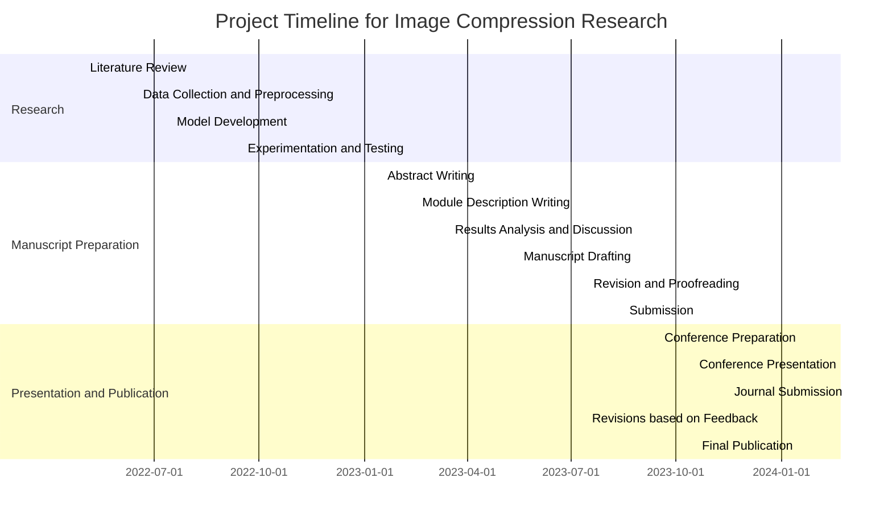
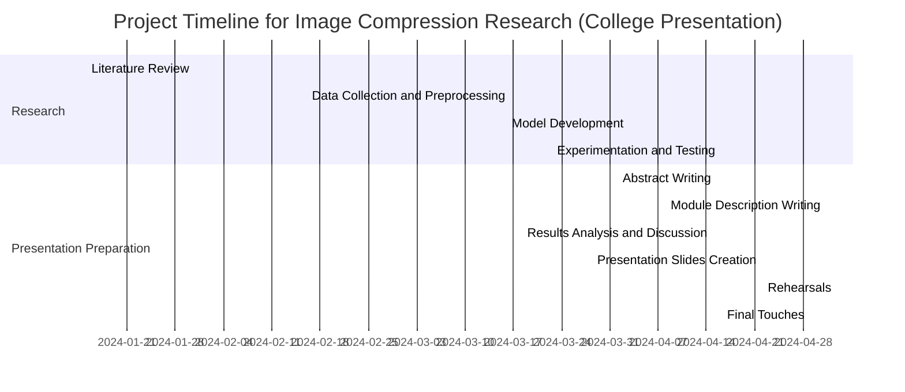
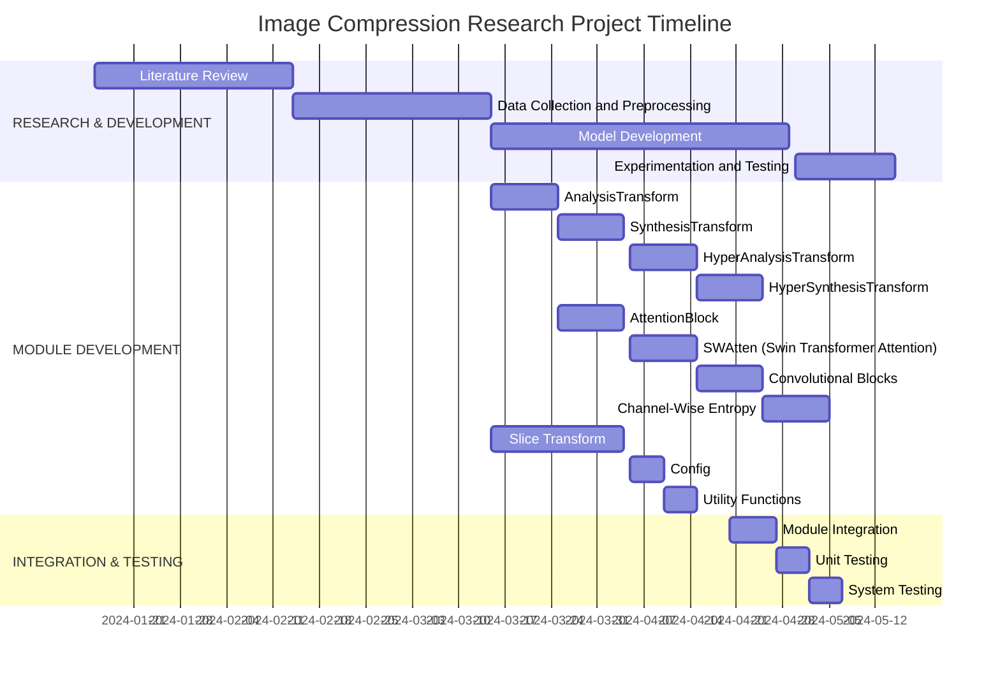
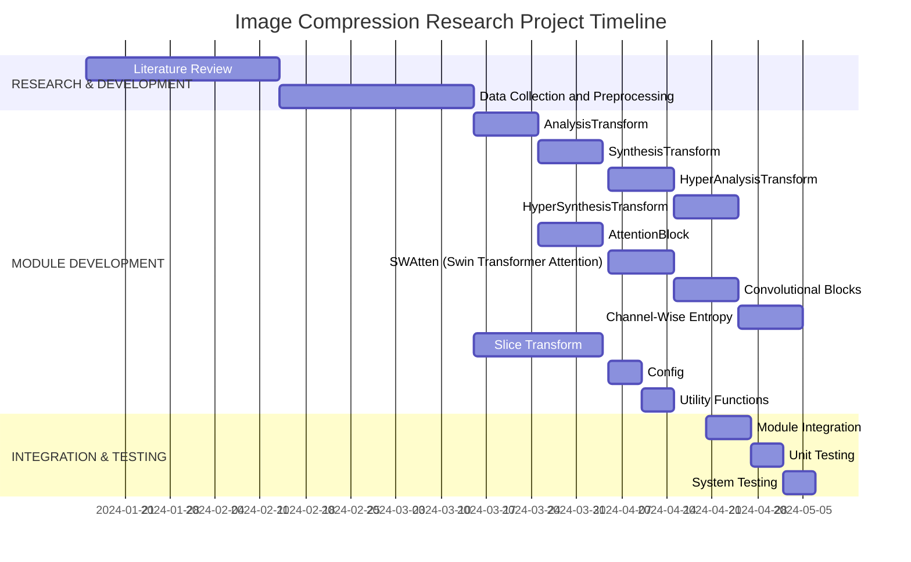
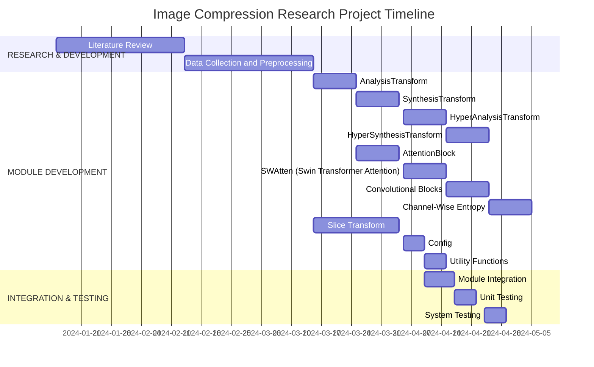
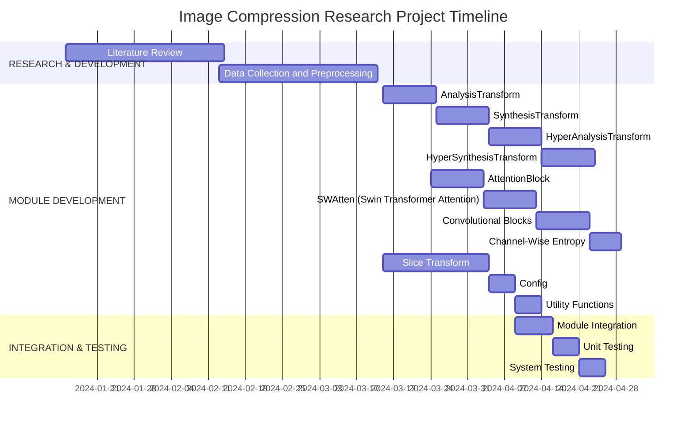
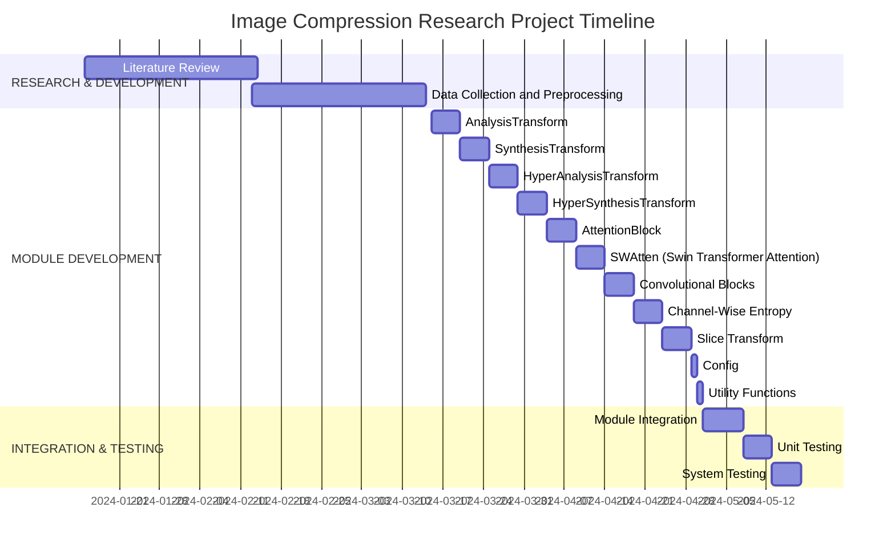
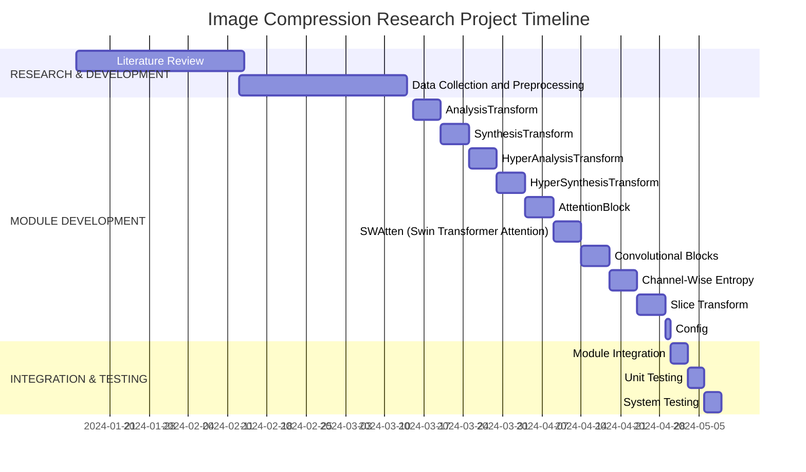
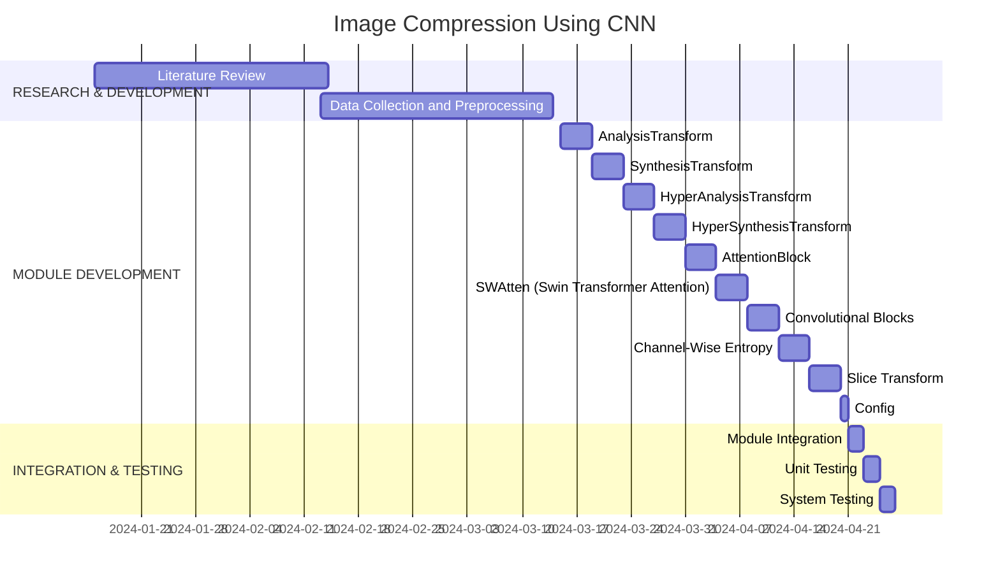
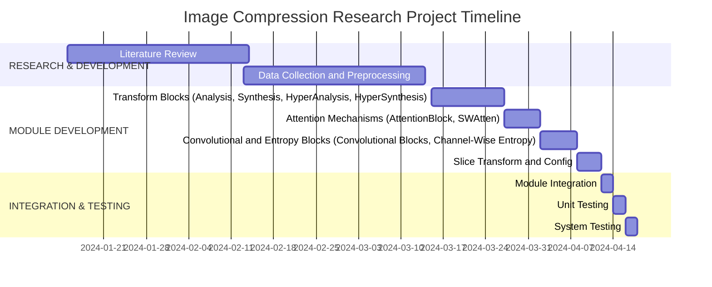

```mermaid
gantt
    title Project Timeline for Image Compression Research

    section Research
    Literature Review                      :a1, 2022-05-01, 2022-06-15
    Data Collection and Preprocessing      :a2, 2022-06-16, 2022-07-15
    Model Development                      :a3, 2022-07-16, 2022-09-15
    Experimentation and Testing            :a4, 2022-09-16, 2023-01-15

    section Manuscript Preparation
    Abstract Writing                       :b1, 2023-01-16, 2023-02-15
    Module Description Writing             :b2, 2023-02-16, 2023-03-15
    Results Analysis and Discussion        :b3, 2023-03-16, 2023-05-15
    Manuscript Drafting                    :b4, 2023-05-16, 2023-07-15
    Revision and Proofreading              :b5, 2023-07-16, 2023-08-15
    Submission                             :b6, 2023-08-16, 2023-09-15

    section Presentation and Publication
    Conference Preparation                :c1, 2023-09-16, 2023-10-15
    Conference Presentation               :c2, 2023-10-16, 2023-11-15
    Journal Submission                    :c3, 2023-11-16, 2023-12-15
    Revisions based on Feedback           :c4, 2023-12-16, 2024-01-15
    Final Publication                     :c5, 2024-01-16, 2024-02-15

```

```mermaid
gantt
    title Project Timeline for Image Compression Research (College Presentation)

    section Research
    Literature Review                      :a1, 2024-01-15, 2024-02-15
    Data Collection and Preprocessing      :a2, 2024-02-16, 2024-03-15
    Model Development                      :a3, 2024-03-16, 2024-04-15
    Experimentation and Testing            :a4, 2024-04-16, 2024-04-30

    section Presentation Preparation
    Abstract Writing                       :b1, 2024-04-01, 2024-04-07
    Module Description Writing             :b2, 2024-04-08, 2024-04-14
    Results Analysis and Discussion        :b3, 2024-04-15, 2024-04-21
    Presentation Slides Creation           :b4, 2024-04-22, 2024-04-28
    Rehearsals                             :b5, 2024-04-22, 2024-04-28
    Final Touches                          :b6, 2024-04-29, 2024-04-30

```

```mermaid
gantt
	title Image Compression Research Project Timeline
	dateFormat DD/MM/YY
	section RESEARCH & DEVELOPMENT
		Literature Review: 15/01/24, 30d
		Data Collection and Preprocessing: 14/02/24, 30d
		Model Development: 15/03/24, 45d
		Experimentation and Testing: 30/04/24, 15d
	section MODULE DEVELOPMENT
		AnalysisTransform: 15/03/24, 10d
		SynthesisTransform: 25/03/24, 10d
		HyperAnalysisTransform: 05/04/24, 10d
		HyperSynthesisTransform: 15/04/24, 10d
		AttentionBlock: 25/03/24, 10d
		SWAtten (Swin Transformer Attention): 05/04/24, 10d
		Convolutional Blocks: 15/04/24, 10d
		Channel-Wise Entropy: 25/04/24, 10d
		Slice Transform: 15/03/24, 20d
		Config: 05/04/24, 5d
		Utility Functions: 10/04/24, 5d
	section INTEGRATION & TESTING
		Module Integration: 20/04/24, 7d
		Unit Testing: 27/04/24, 5d
		System Testing: 02/05/24, 5d

```

```mermaid
gantt
	title Image Compression Research Project Timeline
	dateFormat DD/MM/YY
	section RESEARCH & DEVELOPMENT
		Literature Review: 15/01/24, 30d
		Data Collection and Preprocessing: 14/02/24, 30d
	section MODULE DEVELOPMENT
		AnalysisTransform: 15/03/24, 10d
		SynthesisTransform: 25/03/24, 10d
		HyperAnalysisTransform: 05/04/24, 10d
		HyperSynthesisTransform: 15/04/24, 10d
		AttentionBlock: 25/03/24, 10d
		SWAtten (Swin Transformer Attention): 05/04/24, 10d
		Convolutional Blocks: 15/04/24, 10d
		Channel-Wise Entropy: 25/04/24, 10d
		Slice Transform: 15/03/24, 20d
		Config: 05/04/24, 5d
		Utility Functions: 10/04/24, 5d
	section INTEGRATION & TESTING
		Module Integration: 20/04/24, 7d
		Unit Testing: 27/04/24, 5d
		System Testing: 02/05/24, 5d

```

```mermaid
gantt
	title Image Compression Research Project Timeline
	dateFormat DD/MM/YY
	section RESEARCH & DEVELOPMENT
		Literature Review: 15/01/24, 30d
		Data Collection and Preprocessing: 14/02/24, 30d
	section MODULE DEVELOPMENT
		AnalysisTransform: 15/03/24, 10d
		SynthesisTransform: 25/03/24, 10d
		HyperAnalysisTransform: 05/04/24, 10d
		HyperSynthesisTransform: 15/04/24, 10d
		AttentionBlock: 25/03/24, 10d
		SWAtten (Swin Transformer Attention): 05/04/24, 10d
		Convolutional Blocks: 15/04/24, 10d
		Channel-Wise Entropy: 25/04/24, 10d
		Slice Transform: 15/03/24, 20d
		Config: 05/04/24, 5d
		Utility Functions: 10/04/24, 5d
	section INTEGRATION & TESTING
		Module Integration: 20/04/24, 7d
		Unit Testing: 27/04/24, 5d
		System Testing: 02/05/24, 5d

```

```mermaid
gantt
	title Image Compression Research Project Timeline
	dateFormat DD/MM/YY
	section RESEARCH & DEVELOPMENT
		Literature Review: 15/01/24, 30d
		Data Collection and Preprocessing: 14/02/24, 30d
	section MODULE DEVELOPMENT
		AnalysisTransform: 15/03/24, 10d
		SynthesisTransform: 25/03/24, 10d
		HyperAnalysisTransform: 05/04/24, 10d
		HyperSynthesisTransform: 15/04/24, 10d
		AttentionBlock: 25/03/24, 10d
		SWAtten (Swin Transformer Attention): 05/04/24, 10d
		Convolutional Blocks: 15/04/24, 10d
		Channel-Wise Entropy: 25/04/24, 10d
		Slice Transform: 15/03/24, 20d
		Config: 05/04/24, 5d
		Utility Functions: 10/04/24, 5d
	section INTEGRATION & TESTING
		Module Integration: 20/04/24, 7d
		Unit Testing: 27/04/24, 5d
		System Testing: 02/05/24, 5d

```

```mermaid
gantt
	title Image Compression Research Project Timeline
	dateFormat DD/MM/YY
	section RESEARCH & DEVELOPMENT
		Literature Review: 15/01/24, 30d
		Data Collection and Preprocessing: 14/02/24, 30d
	section MODULE DEVELOPMENT
		AnalysisTransform: 15/03/24, 10d
		SynthesisTransform: 25/03/24, 10d
		HyperAnalysisTransform: 05/04/24, 10d
		HyperSynthesisTransform: 15/04/24, 10d
		AttentionBlock: 25/03/24, 10d
		SWAtten (Swin Transformer Attention): 05/04/24, 10d
		Convolutional Blocks: 15/04/24, 10d
		Channel-Wise Entropy: 25/04/24, 10d
		Slice Transform: 15/03/24, 20d
		Config: 05/04/24, 5d
		Utility Functions: 10/04/24, 5d
	section INTEGRATION & TESTING
		Module Integration: 10/04/24, 7d
		Unit Testing: 17/04/24, 5d
		System Testing: 24/04/24, 5d

```

```mermaid
gantt
	title Image Compression Research Project Timeline
	dateFormat DD/MM/YY
	section RESEARCH & DEVELOPMENT
		Literature Review: 15/01/24, 30d
		Data Collection and Preprocessing: 13/02/24, 30d
	section MODULE DEVELOPMENT
		AnalysisTransform: 15/03/24, 10d
		SynthesisTransform: 25/03/24, 10d
		HyperAnalysisTransform: 04/04/24, 10d
		HyperSynthesisTransform: 14/04/24, 10d
		AttentionBlock: 24/03/24, 10d
		SWAtten (Swin Transformer Attention): 03/04/24, 10d
		Convolutional Blocks: 13/04/24, 10d
		Channel-Wise Entropy: 23/04/24, 6d
		Slice Transform: 15/03/24, 20d
		Config: 04/04/24, 5d
		Utility Functions: 09/04/24, 5d
	section INTEGRATION & TESTING
		Module Integration: 09/04/24, 7d
		Unit Testing: 16/04/24, 5d
		System Testing: 21/04/24, 5d

```

```mermaid
gantt
	title Image Compression Research Project Timeline
	dateFormat DD/MM/YY
	section RESEARCH & DEVELOPMENT
		Literature Review: 15/01/24, 30d
		Data Collection and Preprocessing: 13/02/24, 30d
	section MODULE DEVELOPMENT
		AnalysisTransform: 15/03/24, 5d
		SynthesisTransform: 20/03/24, 5d
		HyperAnalysisTransform: 25/03/24, 5d
		HyperSynthesisTransform: 30/03/24, 5d
		AttentionBlock: 04/04/24, 5d
		SWAtten (Swin Transformer Attention): 09/04/24, 5d
		Convolutional Blocks: 14/04/24, 5d
		Channel-Wise Entropy: 19/04/24, 5d
		Slice Transform: 24/04/24, 5d
		Config: 29/04/24, 1d
		Utility Functions: 30/04/24, 1d
	section INTEGRATION & TESTING
		Module Integration: 01/05/24, 7d
		Unit Testing: 08/05/24, 5d
		System Testing: 13/05/24, 5d

```

```mermaid
gantt
	title Image Compression Research Project Timeline
	dateFormat DD/MM/YY
	section RESEARCH & DEVELOPMENT
		Literature Review: 15/01/24, 30d
		Data Collection and Preprocessing: 13/02/24, 30d
	section MODULE DEVELOPMENT
		AnalysisTransform: 15/03/24, 5d
		SynthesisTransform: 20/03/24, 5d
		HyperAnalysisTransform: 25/03/24, 5d
		HyperSynthesisTransform: 30/03/24, 5d
		AttentionBlock: 04/04/24, 5d
		SWAtten (Swin Transformer Attention): 09/04/24, 5d
		Convolutional Blocks: 14/04/24, 5d
		Channel-Wise Entropy: 19/04/24, 5d
		Slice Transform: 24/04/24, 5d
		Config: 29/04/24, 1d
	section INTEGRATION & TESTING
		Module Integration: 30/04/24, 3d
		Unit Testing: 03/05/24, 3d
		System Testing: 06/05/24, 3d

```

```mermaid
gantt
	title Image Compression Using CNN
	dateFormat DD/MM/YY
	section RESEARCH & DEVELOPMENT
		Literature Review: 15/01/24, 30d
		Data Collection and Preprocessing: 13/02/24, 30d
	section MODULE DEVELOPMENT
		AnalysisTransform: 15/03/24, 4d
		SynthesisTransform: 19/03/24, 4d
		HyperAnalysisTransform: 23/03/24, 4d
		HyperSynthesisTransform: 27/03/24, 4d
		AttentionBlock: 31/03/24, 4d
		SWAtten (Swin Transformer Attention): 04/04/24, 4d
		Convolutional Blocks: 08/04/24, 4d
		Channel-Wise Entropy: 12/04/24, 4d
		Slice Transform: 16/04/24, 4d
		Config: 20/04/24, 1d
	section INTEGRATION & TESTING
		Module Integration: 21/04/24, 2d
		Unit Testing: 23/04/24, 2d
		System Testing: 25/04/24, 2d


```

```mermaid
gantt
	title Image Compression Research Project Timeline
	dateFormat DD/MM/YY
	section RESEARCH & DEVELOPMENT
		Literature Review: 15/01/24, 30d
		Data Collection and Preprocessing: 13/02/24, 30d
	section MODULE DEVELOPMENT
		Transform Blocks (Analysis, Synthesis, HyperAnalysis, HyperSynthesis): 15/03/24, 12d
		Attention Mechanisms (AttentionBlock, SWAtten): 27/03/24, 6d
		Convolutional and Entropy Blocks (Convolutional Blocks, Channel-Wise Entropy): 02/04/24, 6d
		Slice Transform and Config: 08/04/24, 4d
	section INTEGRATION & TESTING
		Module Integration: 12/04/24, 2d
		Unit Testing: 14/04/24, 2d
		System Testing: 16/04/24, 2d

```
