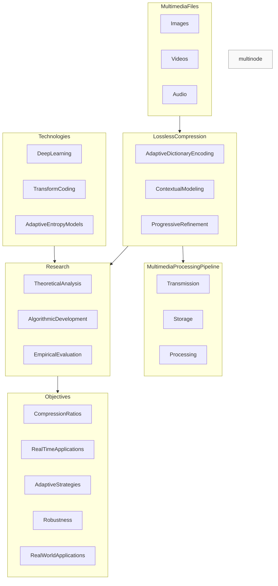
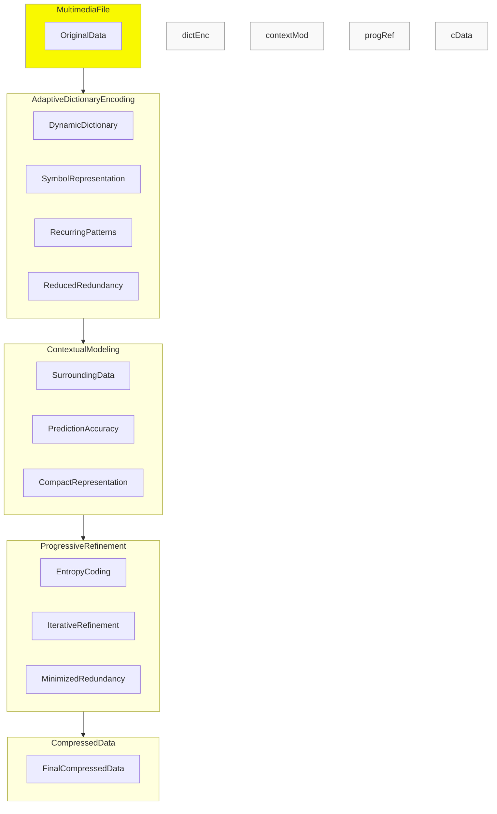
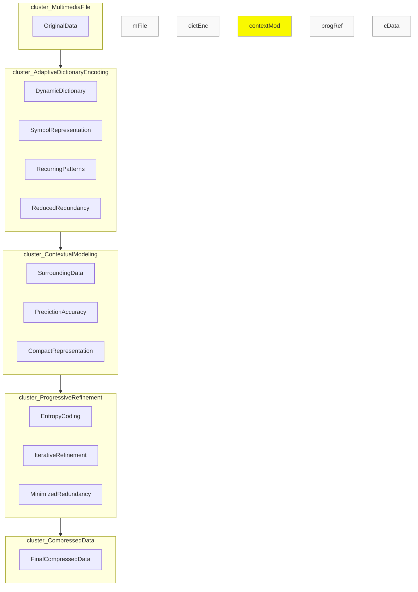
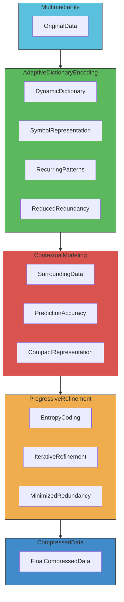
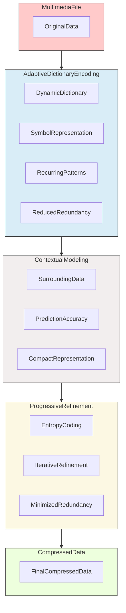
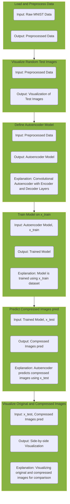

## Literature Survey

| S. No. | Title                                                      | Methodology                                           | Advantages                                               | Disadvantages                                            | Result Analysis                                        |
|--------|------------------------------------------------------------|-------------------------------------------------------|----------------------------------------------------------|-----------------------------------------------------------|--------------------------------------------------------|
| 1      | Gormish, M. J., Schwartz, E. L., Keith, A. F., Boliek, M. P., & Zandi, A. (1997). Lossless and nearly lossless compression for high-quality images. Very High Resolution and Quality Imaging II, 3025, 62-70. | Reversible color transform, reversible wavelet transform, doubly embedded context model, importance level quantization, tiled and tagged file structure, idempotent overall compression system, binary entropy coder | - Selective decoding without full decompression - Access to important data segments - Device-specific quantization - Lossless compression | - Requires a change in viewpoint about compression - Complex technologies and algorithms involved - High storage requirements for color high-resolution scans | - Provides the highest quality at low bandwidth requirements - Solutions for high-quality imaging needs - Reversible transformations and context modeling - Idempotent compression system for decompression and recompression without continual degradation |
| 2 | Mentzer, F., Agustsson, E., Tschannen, M., Timofte, R., & Gool, L. V. (2019). Practical full resolution learned lossless image compression. In Proceedings of the IEEE/CVF conference on computer vision and pattern recognition (pp. 10629-10638). | Fully parallelizable hierarchical probabilistic model for adaptive entropy coding, optimized end-to-end for compression. Models image distribution jointly with learned auxiliary representations, requiring three forward-passes for all pixel probabilities. Outperforms PNG, JPEG2000, and WebP. Significantly faster than PixelCNN variant (Multiscale-PixelCNN). Learning auxiliary representation crucial. | - Outperforms engineered codecs PNG, JPEG2000, and WebP - Over two orders of magnitude speedups compared to fastest PixelCNN variant - Crucial role of learning auxiliary representation - Superior performance on all datasets | - Requires further investigation of weak autoregression across pixels - Dynamic adaptation of the model network for improvement - Potential exploration of domain-specific applications, e.g., medical image data | - Fully parallel hierarchical probabilistic model with auxiliary feature representations - Outperforms RGB Shared and RGB baselines - Significant speed advantage over PixelCNN-based methods - Potential for future enhancements in autoregression and dynamic adaptation |
| 3 | Shieh, W. Y., Chen, T. F., Shann, J. J. J., & Chung, C. P. (2003). Inverted file compression through document identifier reassignment. Information processing & management, 39(1), 117-131. | Document identifier reassignment based on similarity factor to reduce gap values in d-gapped inverted files. Proposes an algorithm to reorder identifiers according to document relationships. Average gap values in inverted files reduced by 30%, and compression rate of d-gapped inverted file with prefix-free codes improved by 15%. | - Efficiently reduces gap values in d-gapped inverted files - Utilizes similarity between documents for identifier reassignment - Algorithm transforms problem to TSP for identifier reassignment order generation - Simulation results demonstrate 30% reduction in average gap values | - Limited discussion on the specific types of prefix-free codes used - Theoretical nature of the proposed algorithm may require further practical validation - Specifics on the datasets and scenarios used in simulation results are not detailed | - Successful reduction of average gap values in d-gapped inverted files - Improved compression rate with prefix-free codes - Algorithm transformation to TSP for identifier reassignment order generation - Practical implications for enhancing document search in information retrieval systems |
| 4 | Hernández-Hernández, J. L., Hernández-Hernández, M., Sabzi, S., Paredes-Valverde, M. A., & Penna, A. F. (2019, November). A Byte Pattern Based Method for File Compression. In International Conference on Technologies and Innovation (pp. 122-134). Cham: Springer International Publishing. | Byte pattern-based method for file compression combining pattern theory with data compression. Aims to reduce storage space for files on any computer, platform, or operating system. Implemented as a beta mode compression software for Windows 10 with promising results. | - Combines pattern theory with data compression for a unique approach - Targets reduction of storage space on various computer systems - Implementation in a beta mode compression software for Windows 10 - Promising results in compressing approximately 50 files | - Lack of specific details on the pattern theory and data compression techniques used - Limited information on the datasets and scenarios tested in the compression software - The term "compromising results" may need clarification on potential drawbacks | - Novel approach to file compression using byte patterns - Practical implementation as a beta mode compression software for Windows 10 - Positive results in personal testing with a high compression and decompression success rate - Acknowledgment of the changing landscape of data storage and the continued relevance of file compression as a useful tool |
| 5 | Rachmawati, D., Budiman, M. A., & Saffiera, C. A. (2018). An Implementation Of Elias Delta Code And ElGamal Algorithm In Image Compression And Security. In IOP Conference Series: Materials Science and Engineering (Vol. 300, No. 1, p. 012040). IOP Publishing. | Implementation of Elias Delta Code for image compression followed by ElGamal algorithm for security. ElGamal ensures confidentiality and integrity, and Elias Delta Code achieves compression. Prime test using Agrawal Biswas Algorithm. Results show maintained confidentiality and integrity with MSE and PSNR values 0 and infinity. Elias Delta Code yields an average compression ratio of 62.49% and space-saving of 37.51%. | - Integration of Elias Delta Code for compression and ElGamal algorithm for security - ElGamal's strength lies in the difficulty of calculating discrete logs in a large prime modulus - Implementation on Windows 10 Notebook with Intel Core i3 processor and 2048MB RAM - Successful maintenance of image integrity with MSE and PSNR values 0 and infinity | - Lack of detailed discussion on the Agrawal Biswas Algorithm used for prime test - Limited information on the specific datasets and scenarios used in experiments - The description of the development environment is brief and lacks specifics | - Effective combination of Elias Delta Code and ElGamal for image compression and security - Successful maintenance of image integrity with no loss (MSE and PSNR values 0 and infinity) - Demonstrated compression ratio of 62.49% and space-saving of 37.51% on average - Implemented on Windows 10 Notebook with Intel Core i3 processor and 2048MB RAM using C# scripts in SharpDevelop |
| 6 | Rachmawati, D., Hardi, S. M., & Pasaribu, R. P. (2019, December). Combination of columnar transposition cipher caesar cipher and lempel ziv welch algorithm in image security and compression. In Journal of Physics: Conference Series (Vol. 1339, No. 1, p. 012007). IOP Publishing. | Combination of Columnar Transposition Cipher and Caesar Cipher with Linear Congruential Generator modification for image security. Compression with Lempel Ziv Welch algorithm for memory-saving. Encryption stages involve Columnar Transposition Cipher, Caesar Cipher, and Lempel Ziv Welch. Implemented in C#. Results show maintained confidentiality, integrity, and security of data. Lempel Ziv Welch algorithm yields an average compression ratio (RC) of 67.05%, Compression Ratio (CR) of 1.49, and Space Saving (SS) of 32.93%. | - Combination of classic algorithms for image security and compression - Use of Columnar Transposition Cipher, Caesar Cipher, and Linear Congruential Generator - Compression technique with Lempel Ziv Welch algorithm - Implementation in C# programming language | - Limited discussion on specific details of the Linear Congruential Generator modification - Lack of detailed information on datasets and scenarios used in experiments - Brief description of the C# programming environment | - Successful combination of encryption and compression algorithms for image security - Demonstrated confidentiality, integrity, and security of data - Lempel Ziv Welch algorithm achieving an average compression ratio of 67.05% - Positive Compression Ratio (CR) and Space Saving (SS) results |
| 7 | Priya, B. L., & Dhenakaran, S. S. (2018). New Approach for Text Based Image Compression. International Journal of Scientific Research in Science and Technology, 4(8), 489. | Novel approach for text-based image compression. Methodology involves compressing the image, transforming it into an ASCII file based on pixel values, applying text compression to reduce the size, and reverting the text file to a pixel file. Resulting in a compressed image with a small file size. Experimental results demonstrate successful achievement of intended compression goals. | - Introduction of a novel approach for text-based image compression - Compression methodology involving image compression, ASCII transformation, and text compression - Experimental results using MATLAB 8.4 software with a sample image - Achieved compression ratio of 62.2% indicating better image file compression | - Limited details on the specific techniques used for image compression and ASCII transformation - Lack of discussion on potential limitations or challenges in the proposed approach - Brief mention of the experimental setup without detailed information | - Successful implementation of a new approach for image compression - Increased compression ratio compared to other three methods considered for comparison - Demonstrated practical results with a sample image reduction from 28.68 KB to 458 bytes - Encouraging findings for achieving better compression in text-based image compression |
| 8 | Senapatil, B., & Kisan, S. (2018, February). Color image compression using fractal geometry. In 2018 International Conference on Soft-computing and Network Security (ICSNS) (pp. 1-6). IEEE. | Color image compression using fractal geometry. Fractal image compression minimizes image size without degrading quality by exploiting self-similarity. The proposed methodology involves dividing the image into domain and range blocks, applying DCT transformation for signal compression, and using Huffman coding for further compression. Evaluation metrics include compression ratio, Mean Square Error, and Peak Signal Noise Ratio. Results indicate improved performance in compression and recreation ratios. | - Fractal image compression exploiting self-similarity for minimizing image size - Methodology involving DCT transformation and Huffman coding for compression - Division of image into domain and range blocks for efficient compression - Evaluation metrics include compression ratio, Mean Square Error, and Peak Signal Noise Ratio | - Lack of specific details on the datasets and scenarios used in experiments - Limited discussion on the fractal geometry aspects of the compression - Brief mention of parameters RMSE and PSNR without detailed explanation | - Successful application of fractal geometry for color image compression - Methodology involving DCT transformation and Huffman coding demonstrates improved performance - Efficient division of image into domain and range blocks for compression - Positive results in compression and recreation ratios with better performance in both aspects |

