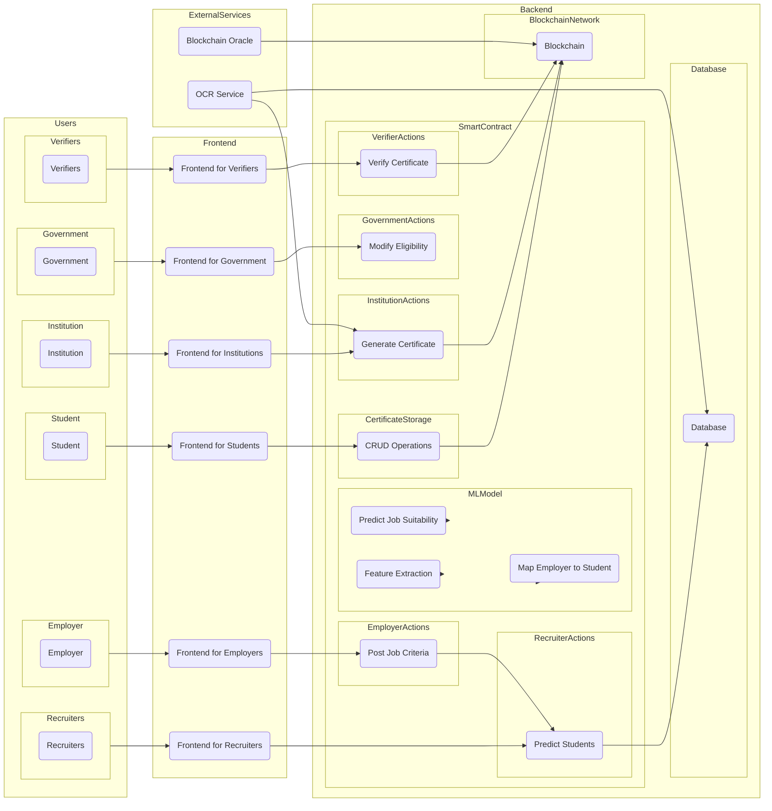
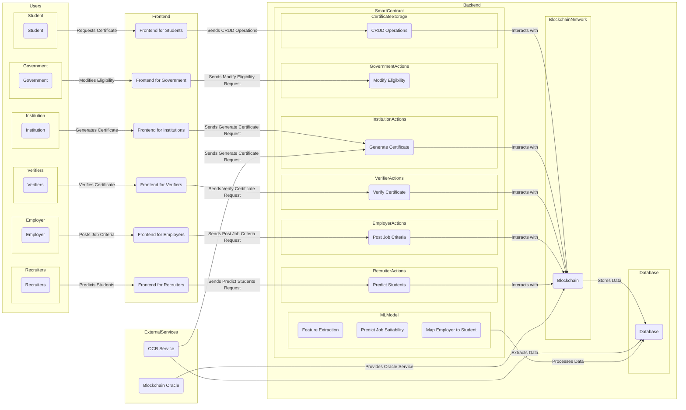

```mermaid
graph LR

subgraph Users
    subgraph Student
        S(Student)
    end
    subgraph Institution
        I(Institution)
    end
    subgraph Government
        G(Government)
    end
    subgraph Employer
        E(Employer)
    end
    subgraph Verifiers
        V(Verifiers)
    end
    subgraph Recruiters
        R(Recruiters)
    end
end

subgraph Frontend
    StudentUI(Frontend for Students)
    InstitutionUI(Frontend for Institutions)
    GovernmentUI(Frontend for Government)
    EmployerUI(Frontend for Employers)
    VerifierUI(Frontend for Verifiers)
    RecruiterUI(Frontend for Recruiters)
end

subgraph Backend
    subgraph SmartContract
        subgraph CertificateStorage
            CRUD(CRUD Operations)
        end
        subgraph GovernmentActions
            ModifyEligibility(Modify Eligibility)
        end
        subgraph InstitutionActions
            GenerateCertificate(Generate Certificate)
        end
        subgraph EmployerActions
            PostJobCriteria(Post Job Criteria)
        end
        subgraph VerifierActions
            VerifyCertificate(Verify Certificate)
        end
        subgraph RecruiterActions
            PredictStudents(Predict Students)
        end
        subgraph MLModel
            FeatureExtraction(Feature Extraction)
            PredictJobSuitability(Predict Job Suitability)
            MapEmployerToStudent(Map Employer to Student)
        end
    end
    subgraph BlockchainNetwork
        BC(Blockchain)
    end
    subgraph Database
        DB(Database)
    end
end

subgraph ExternalServices
    OCR(OCR Service)
    BlockchainOracle(Blockchain Oracle)
end

Student --> StudentUI
Institution --> InstitutionUI
Government --> GovernmentUI
Employer --> EmployerUI
Verifiers --> VerifierUI
Recruiters --> RecruiterUI

StudentUI --> CRUD
InstitutionUI --> GenerateCertificate
GovernmentUI --> ModifyEligibility
EmployerUI --> PostJobCriteria
VerifierUI --> VerifyCertificate
RecruiterUI --> PredictStudents

CRUD --> BC
GenerateCertificate --> BC
VerifyCertificate --> BC
PostJobCriteria --> PredictStudents
PredictStudents --> DB
FeatureExtraction --> MLModel
PredictJobSuitability --> MLModel
MapEmployerToStudent --> MLModel

OCR --> DB
OCR --> GenerateCertificate
BlockchainOracle --> BC

```

```mermaid
graph LR

subgraph Users
    subgraph Student
        S(Student)
    end
    subgraph Institution
        I(Institution)
    end
    subgraph Government
        G(Government)
    end
    subgraph Employer
        E(Employer)
    end
    subgraph Verifiers
        V(Verifiers)
    end
    subgraph Recruiters
        R(Recruiters)
    end
end

subgraph Frontend
    StudentUI(Frontend for Students)
    InstitutionUI(Frontend for Institutions)
    GovernmentUI(Frontend for Government)
    EmployerUI(Frontend for Employers)
    VerifierUI(Frontend for Verifiers)
    RecruiterUI(Frontend for Recruiters)
end

subgraph Backend
    subgraph SmartContract
        subgraph CertificateStorage
            CRUD(CRUD Operations)
        end
        subgraph GovernmentActions
            ModifyEligibility(Modify Eligibility)
        end
        subgraph InstitutionActions
            GenerateCertificate(Generate Certificate)
        end
        subgraph EmployerActions
            PostJobCriteria(Post Job Criteria)
        end
        subgraph VerifierActions
            VerifyCertificate(Verify Certificate)
        end
        subgraph RecruiterActions
            PredictStudents(Predict Students)
        end
        subgraph MLModel
            FeatureExtraction(Feature Extraction)
            PredictJobSuitability(Predict Job Suitability)
            MapEmployerToStudent(Map Employer to Student)
        end
    end
    subgraph BlockchainNetwork
        BC(Blockchain)
    end
    subgraph Database
        DB(Database)
    end
end

subgraph ExternalServices
    OCR(OCR Service)
    BlockchainOracle(Blockchain Oracle)
end

Student -->|Requests Certificate| StudentUI
Institution -->|Generates Certificate| InstitutionUI
Government -->|Modifies Eligibility| GovernmentUI
Employer -->|Posts Job Criteria| EmployerUI
Verifiers -->|Verifies Certificate| VerifierUI
Recruiters -->|Predicts Students| RecruiterUI

StudentUI -->|Sends CRUD Operations| CRUD
InstitutionUI -->|Sends Generate Certificate Request| GenerateCertificate
GovernmentUI -->|Sends Modify Eligibility Request| ModifyEligibility
EmployerUI -->|Sends Post Job Criteria Request| PostJobCriteria
VerifierUI -->|Sends Verify Certificate Request| VerifyCertificate
RecruiterUI -->|Sends Predict Students Request| PredictStudents

CRUD -->|Interacts with| BC
GenerateCertificate -->|Interacts with| BC
VerifyCertificate -->|Interacts with| BC
PostJobCriteria -->|Interacts with| BC
PredictStudents -->|Interacts with| BC

BC -->|Stores Data| DB
MLModel -->|Processes Data| DB
OCR -->|Extracts Data| DB
OCR -->|Sends Generate Certificate Request| GenerateCertificate
BlockchainOracle -->|Provides Oracle Service| BC

```
