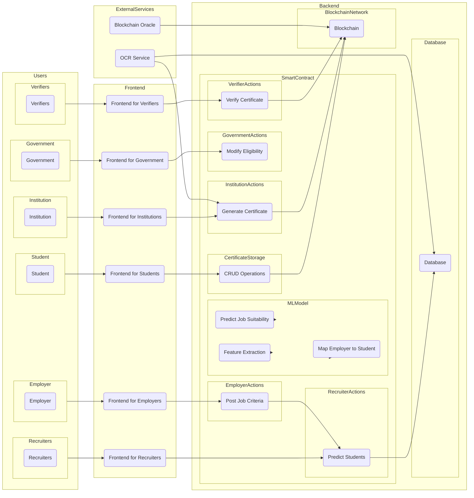

```mermaid
graph LR

subgraph Users
    subgraph Student
        S(Student)
    end
    subgraph Institution
        I(Institution)
    end
    subgraph Government
        G(Government)
    end
    subgraph Employer
        E(Employer)
    end
    subgraph Verifiers
        V(Verifiers)
    end
    subgraph Recruiters
        R(Recruiters)
    end
end

subgraph Frontend
    StudentUI(Frontend for Students)
    InstitutionUI(Frontend for Institutions)
    GovernmentUI(Frontend for Government)
    EmployerUI(Frontend for Employers)
    VerifierUI(Frontend for Verifiers)
    RecruiterUI(Frontend for Recruiters)
end

subgraph Backend
    subgraph SmartContract
        subgraph CertificateStorage
            CRUD(CRUD Operations)
        end
        subgraph GovernmentActions
            ModifyEligibility(Modify Eligibility)
        end
        subgraph InstitutionActions
            GenerateCertificate(Generate Certificate)
        end
        subgraph EmployerActions
            PostJobCriteria(Post Job Criteria)
        end
        subgraph VerifierActions
            VerifyCertificate(Verify Certificate)
        end
        subgraph RecruiterActions
            PredictStudents(Predict Students)
        end
        subgraph MLModel
            FeatureExtraction(Feature Extraction)
            PredictJobSuitability(Predict Job Suitability)
            MapEmployerToStudent(Map Employer to Student)
        end
    end
    subgraph BlockchainNetwork
        BC(Blockchain)
    end
    subgraph Database
        DB(Database)
    end
end

subgraph ExternalServices
    OCR(OCR Service)
    BlockchainOracle(Blockchain Oracle)
end

Student --> StudentUI
Institution --> InstitutionUI
Government --> GovernmentUI
Employer --> EmployerUI
Verifiers --> VerifierUI
Recruiters --> RecruiterUI

StudentUI --> CRUD
InstitutionUI --> GenerateCertificate
GovernmentUI --> ModifyEligibility
EmployerUI --> PostJobCriteria
VerifierUI --> VerifyCertificate
RecruiterUI --> PredictStudents

CRUD --> BC
GenerateCertificate --> BC
VerifyCertificate --> BC
PostJobCriteria --> PredictStudents
PredictStudents --> DB
FeatureExtraction --> MLModel
PredictJobSuitability --> MLModel
MapEmployerToStudent --> MLModel

OCR --> DB
OCR --> GenerateCertificate
BlockchainOracle --> BC

```
