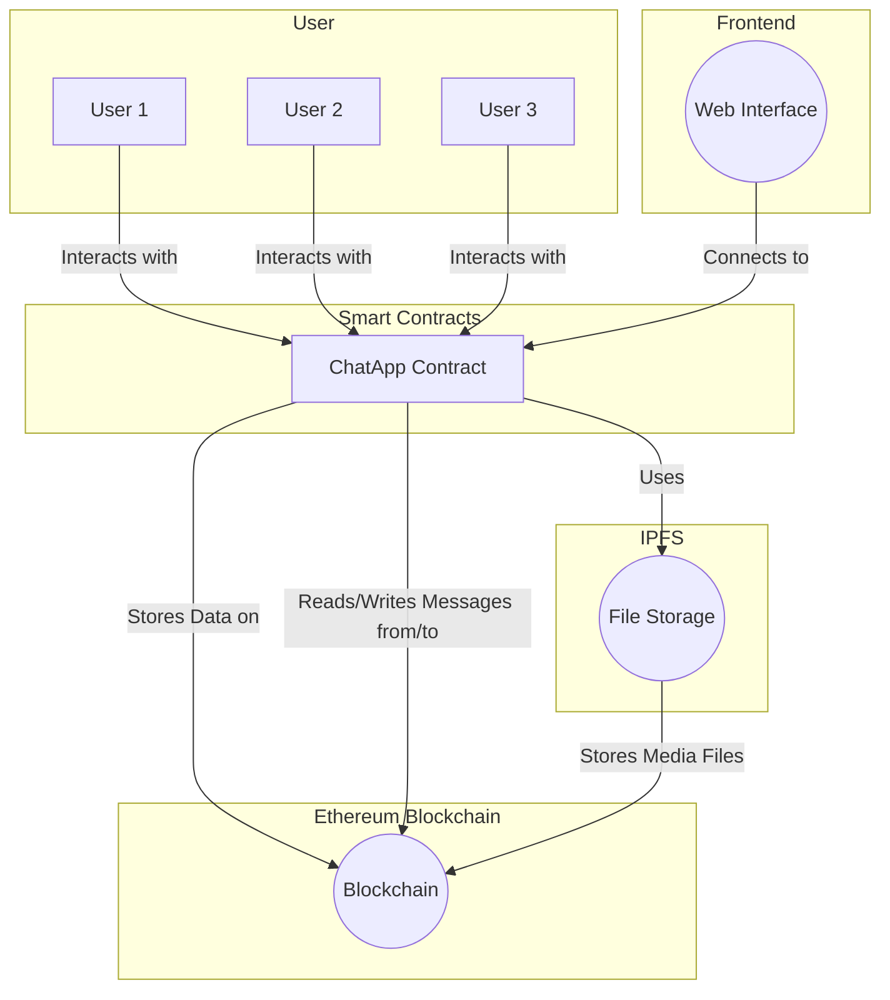
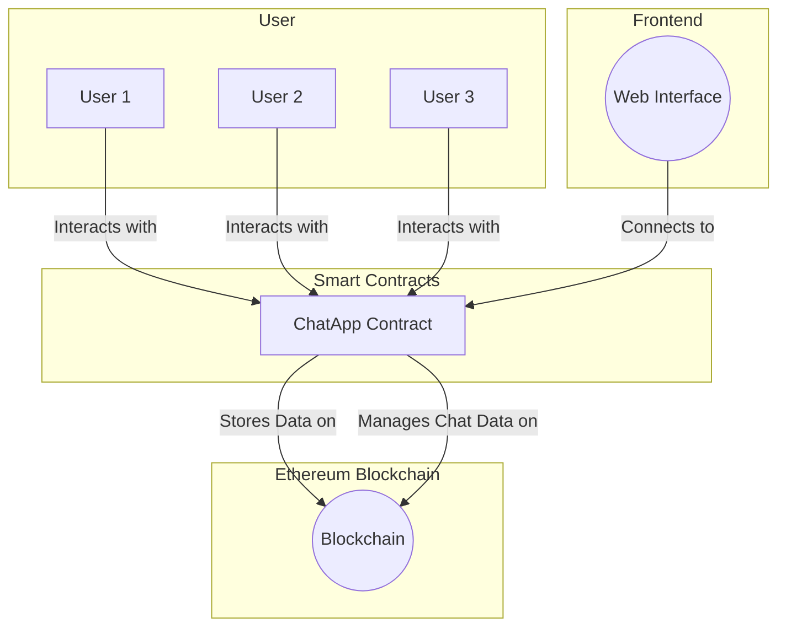
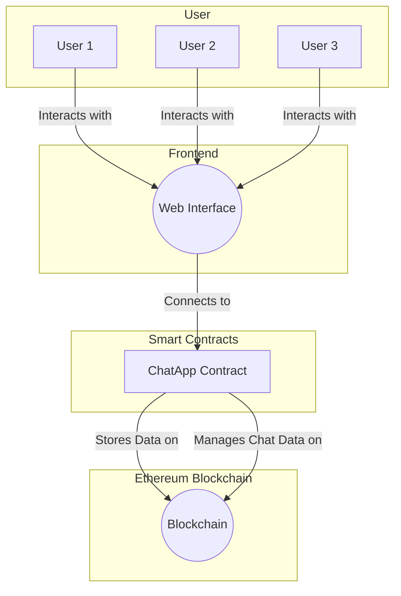
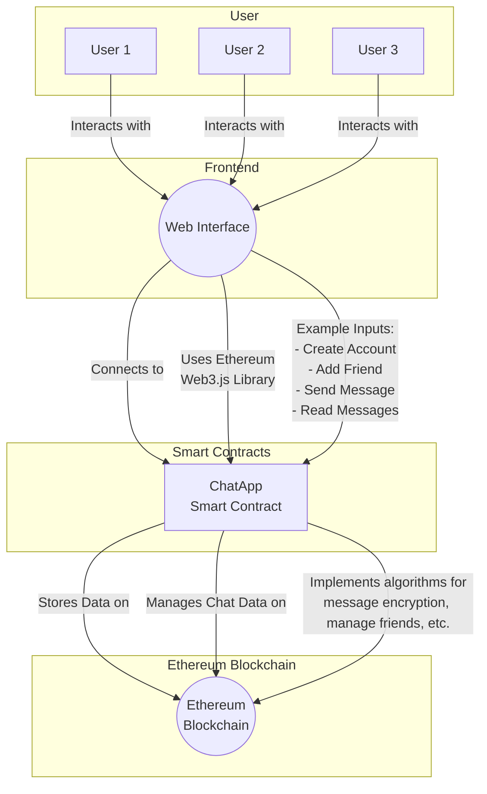

| S. No. | Name of the Transaction/Journal/Conference with Year | Major Technologies Used | Result/Outcome of Their Research | Drawbacks If Any |
|-------|-------------------------------------------------------|-------------------------|---------------------------------|-------------------|
| 1     | Smart integrated IoT healthcare system for cancer care (2021) | IoT, WSN (Wireless Sensor Networks) | Proposed an IoT-based healthcare system for cancer care services and business analytics/cloud services. | Operational and security challenges associated with IoT-based medical system deployment. |
| 2     | IoMT-based wearable body sensors network healthcare monitoring system (2021) | IoMT (Internet of Medical Things), Wearable body sensor network | Proposed an intelligent IoMT healthcare system for monitoring patients' health using wearable body sensor network. The system uses ensemble tree-based learning to disclose patterns and knowledge on patient health conditions and its possible preventions, providing real-time alerts to medical personnel. | Challenges in designing an IoMT healthcare system, including security, authentication, and data exchange. |
| 3     | Internet of Things (IoT) for healthcare application: Wearable sleep body position monitoring system using IoT platform (2020) | IoT (Internet of Things), MySignals HW Complete Kit, Arduino Uno, ESP8266, LEDs, Speakers, Micro SD Card, Machine Learning | Developed a wearable body position monitor for users with health conditions like dementia. The system can detect body position, maintain sleep records, provide light to assist in falling asleep, and activate emergency alerts to caregivers when the user remains seated or stands for extended durations at night. Main components include MySignals HW Complete Kit, Arduino Uno, LEDs, speakers, micro SD card, and ESP8266 module. Real-time data transmission, analysis, and visualization have been implemented. Future work involves applying sleep pattern recognition and machine learning techniques to large datasets and real biometric measurements. | Not mentioned in the abstract. |
| 4     | Design and implementation of a wearable sensor network system for IoT-connected safety and health applications (2019) | IoT (Internet of Things), Wearable Sensors, LoRa, Bluetooth, IoT Gateway | Presented a wearable sensor network system for IoT-connected safety and health applications, with a focus on industrial outdoor workplaces. The system monitors both physiological and environmental data using wearable sensors attached to workers' bodies. It incorporates multiple wearable sensors that communicate with each other and transmit data to a gateway via a LoRa network. A smart IoT gateway processes and forwards the data to an IoT cloud for storage, processing, and visualization. The system provides safety and health monitoring for workers and system operators. Future work may involve integrating different environmental and physiological sensors and developing a smartphone-based IoT gateway to reduce dependency on fixed locations. | Not mentioned in the abstract. |
| 5     | Healthcare and Patient Monitoring Using IoT (2020) | IoT (Internet of Things), Wireless Body Area Networks (WBAN), ZigBee, MicaZ Wireless Modules | Discusses the application of IoT technology in the healthcare sector, including remote health and monitoring services, assisted living, elderly care, chronic disease management, and personalized medication. The paper focuses on a specific biomedical application based on a Wireless Body Area Network (WBAN) to monitor patients' vital signs, including pulse rate, plethysmogram, and relative oxygen ratio. Data collected by the WBAN is transferred to a central database using IoT technology. The system's performance is evaluated in terms of resilience, data correctness, network stability, and effective range. The paper also explores future trends, such as Bio-IoT and Nano-IoT, in the healthcare sector. | Not mentioned in the abstract. |
| 6     | Smart mask–Wearable IoT solution for improved protection and personal health (2022) | IoT (Internet of Things), Sensing, AI, Wireless, IoT, Software | Envisions the Smart Mask, an IoT-supported platform and ecosystem to prevent and control the spread of COVID-19 and respiratory viruses. It integrates sensing, materials, AI, wireless, and software to gather real-time health data from users and their environment. The system enables accurate diagnoses, treatment plans, and personalized health trajectories. The paper identifies key research problems and future directions for smart respiratory protective equipment. A Smart Mask prototype was developed, offering an innovative multi-disciplinary R&D venue. The ability to collect and analyze data for preventive and reactionary healthcare is highlighted. The Smart Mask platform combines immersive sensing, AI, IoT, and wireless experience, leveling up personal protection and health tracking. | RPE markets are growing, and users demand advanced masks for various purposes, including fashion, sports, clinical use, and more. The Smart Mask platform offers a total value proposal for improved protection and personal health with health tracking and personalization. |
| 7     | Wearable medical sensor devices, machine and deep learning algorithms, and internet of things-based healthcare systems in COVID-19 patient screening, diagnosis, monitoring, and treatment (2022) | IoT (Internet of Things), Sensing, AI, Wireless, IoT, Software | Discusses wearable medical sensor devices, machine and deep learning algorithms, and IoT-based healthcare systems for COVID-19 patient screening, diagnosis, monitoring, and treatment. The paper addresses the integration of IoT technology in healthcare, including real-time data gathering and personalized health trajectories. It highlights the use of sensing, materials, AI, wireless, and software for improved protection and personal health. The paper also touches on future directions for smart respiratory protective equipment and the growing demand for advanced masks. | Not mentioned in the abstract. |
| 8     | A flexible, wearable, and wireless biosensor patch with internet of medical things applications (2022) | IoT (Internet of Things), Biosensors, Wearable, Wireless, IoT Platform | Presents a flexible and wireless biosensor patch for continuous monitoring of vital signs, including body temperature, blood pressure, and electrocardiography. The patch is designed for long-term use with high mechanical stretchability and reliability on curved skin surfaces. It integrates IoT technology, a smartphone application, website service, and cloud server to improve healthcare quality and reduce the demand for medical resources. The paper also introduces an optimized deep learning architecture for non-invasive continuous blood pressure monitoring. Experimental results meet industry standards. The study highlights the performance of the biosensor patch for cardiovascular monitoring and physiological responses. | Not mentioned in the abstract. |
| 9     | E-healthcare monitoring system using IoT with machine learning approaches (2020) | IoT (Internet of Things), Machine Learning, Healthcare, Wearable Devices | Introduces an IoT application framework, E-Healthcare Monitoring System (EHMS), integrated with machine learning techniques to design an advanced automation system for healthcare. The system connects, monitors, and makes decisions for proper diagnosis. EHMS addresses various health-related services, including daily health alerts, doctor appointments, dietary suggestions, E-Health check-up reports, and more through SMS services. The paper demonstrates the application of machine learning using an online diabetic dataset and plans to collect data from IoT wearable devices for future work. | Not mentioned in the abstract. |
| 10    | A wearable, low-power, real-time ECG monitor for smart t-shirt and IoT healthcare applications (2019) | IoT (Internet of Things), Wearable Devices, ECG Monitoring, BLE (Bluetooth Low Energy), Solar Energy Harvester | Proposes a small, flexible, and wearable real-time electrocardiograph (ECG) monitoring system integrated on a T-shirt, designed for indoor and outdoor use. The system utilizes an off-the-shelf biopotential analog front-end (AFE) chip, AD8232, to collect ECG data, which is transmitted through Bluetooth Low Energy (BLE) to an end device for real-time display via a PC graphical user interface and a smartphone application. The power consumption of the system can be as low as 5.2 mW, and it can operate for more than 110 hours continuously when powered by a 240 mAh rechargeable battery. The system also features a flexible solar energy harvester to extend battery life. Future improvements include the use of dry electrodes, data compression for reduced power consumption, and the development of a cloud database for long-term healthcare applications. | Not mentioned in the abstract. |
