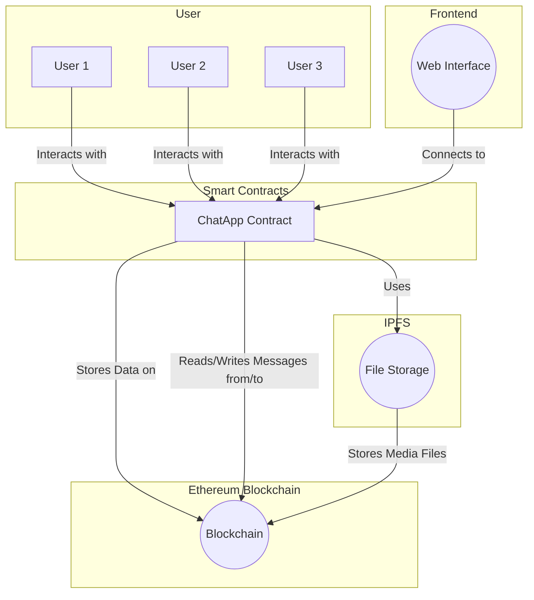
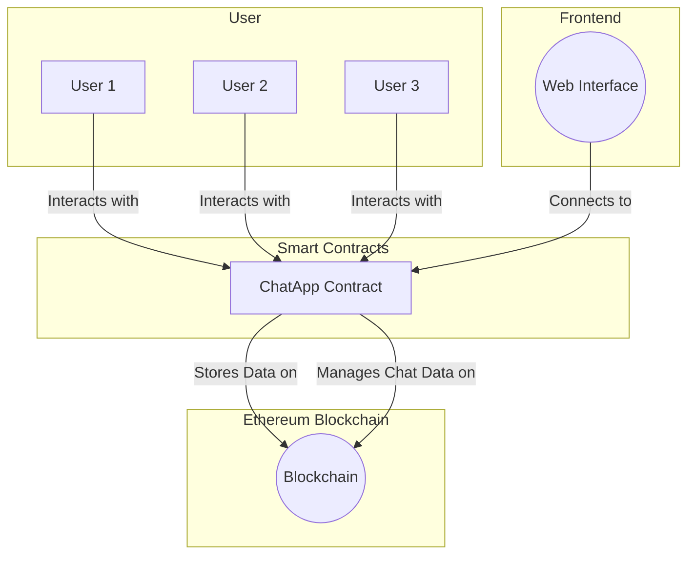
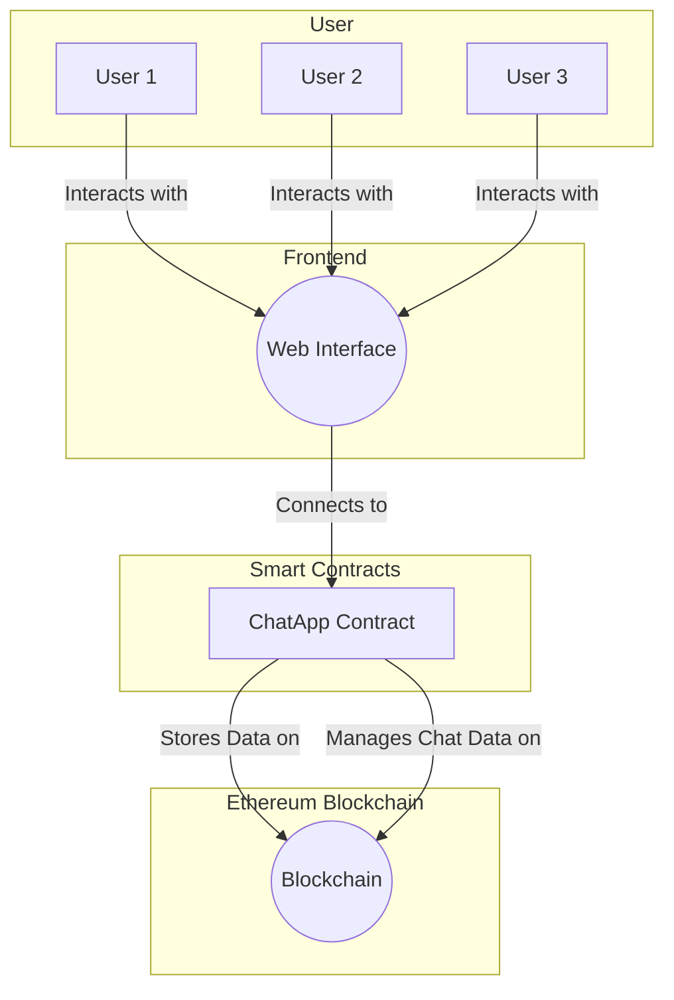
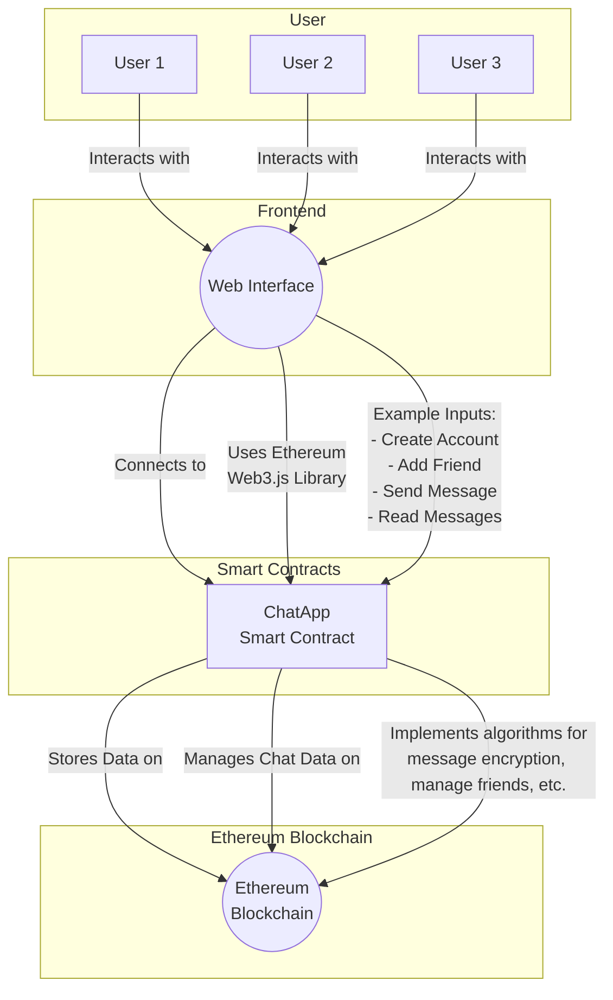

```mermaid
graph TD

subgraph User
    A[User 1]
    B[User 2]
    C[User 3]
end

subgraph Smart Contracts
    D[ChatApp Contract]
end

subgraph Ethereum Blockchain
    E((Blockchain))
end

subgraph Frontend
    F((Web Interface))
end

subgraph IPFS
    G((File Storage))
end

A -->|Interacts with| D
B -->|Interacts with| D
C -->|Interacts with| D
D -->|Stores Data on| E
D -->|Uses| G
F -->|Connects to| D
D -->|Reads/Writes Messages from/to| E
G -->|Stores Media Files| E

```

```mermaid
graph TD

subgraph User
    A[User 1]
    B[User 2]
    C[User 3]
end

subgraph Smart Contracts
    D[ChatApp Contract]
end

subgraph Ethereum Blockchain
    E((Blockchain))
end

subgraph Frontend
    F((Web Interface))
end

A -->|Interacts with| D
B -->|Interacts with| D
C -->|Interacts with| D
D -->|Stores Data on| E
F -->|Connects to| D
D -->|Manages Chat Data on| E

```

```mermaid
graph TD

subgraph User
    A[User 1]
    B[User 2]
    C[User 3]
end

subgraph Smart Contracts
    D[ChatApp Contract]
end

subgraph Ethereum Blockchain
    E((Blockchain))
end

subgraph Frontend
    F((Web Interface))
end

A -->|Interacts with| F
B -->|Interacts with| F
C -->|Interacts with| F
F -->|Connects to| D
D -->|Stores Data on| E
D -->|Manages Chat Data on| E

```

```mermaid
graph TD

subgraph User
    A[User 1]
    B[User 2]
    C[User 3]
end

subgraph Smart Contracts
    D[ChatApp<br/>Smart Contract]
end

subgraph Ethereum Blockchain
    E((Ethereum<br/>Blockchain))
end

subgraph Frontend
    F((Web Interface))
end

A -->|Interacts with| F
B -->|Interacts with| F
C -->|Interacts with| F
F -->|Connects to| D
D -->|Stores Data on| E
D -->|Manages Chat Data on| E
F -->|Uses Ethereum<br/>Web3.js Library|D
D -->|Implements algorithms for<br/>message encryption, manage friends, etc.|E
F -->|Example Inputs:<br/>- Create Account<br/>- Add Friend<br/>- Send Message<br/>- Read Messages|D

```
